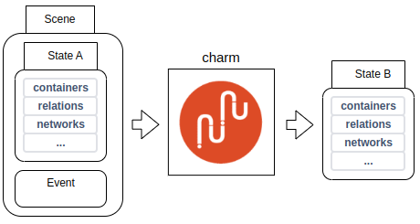

# Scenario

[](https://github.com/canonical/ops-scenario/actions/workflows/build_wheels.yaml)
[](https://github.com/canonical/ops-scenario/actions/workflows/quality_checks.yaml?event=pull_request)
[](https://discourse.charmhub.io)
[](https://github.com/PietroPasotti/jhack)
[](https://discourse.charmhub.io/t/rethinking-charm-testing-with-ops-scenario/8649)
[](https://www.python.org/downloads/release/python-380/)

Scenario is a state-transition testing SDK for Operator Framework charms.

Where the Harness enables you to procedurally mock pieces of the state the charm needs to function, Scenario tests allow
you to declaratively define the state all at once, and use it as a sort of context against which you can fire a single
event on the charm and execute its logic.

This puts scenario tests somewhere in between unit and integration tests: some say 'functional', some say 'contract', I prefer 'state-transition'.

Scenario tests nudge you into thinking of a charm as an input->output function. The input is the
union of an `Event` (why am I, charm, being executed), a `State` (am I leader? what is my relation data? what is my
config?...) and the charm's execution `Context` (what relations can I have? what containers can I have?...). The output is another `State`: the state after the charm has had a chance to interact with the
mocked juju model and affect the initial state back.



For example: a charm currently in `unknown` status is executed with a `start` event, and based on whether it has leadership or not (according to its input state), it will decide to set `active` or `blocked` status (which will be reflected in the output state).

Scenario-testing a charm, then, means verifying that:

- the charm does not raise uncaught exceptions while handling the event
- the output state (or the diff with the input state) is as expected.

# Core concepts as a metaphor

I like metaphors, so here we go:

- There is a theatre stage.
- You pick an actor (a Charm) to put on the stage. Not just any actor: an improv one.
- You arrange the stage with content that the actor will have to interact with. This consists of selecting:
    - An initial situation (`State`) in which the actor is, e.g. is the actor the main role or an NPC (`is_leader`), or what
      other actors are there around it, what is written in those pebble-shaped books on the table?
    - Something that has just happened (an `Event`) and to which the actor has to react (e.g. one of the NPCs leaves the
      stage (`relation-departed`), or the content of one of the books changes).
- How the actor will react to the event will have an impact on the context: e.g. the actor might knock over a table (a
  container), or write something down into one of the books.

# Core concepts not as a metaphor

Scenario tests are about running assertions on atomic state transitions treating the charm being tested like a black
box. An initial state goes in, an event occurs (say, `'start'`) and a new state comes out. Scenario tests are about
validating the transition, that is, consistency-checking the delta between the two states, and verifying the charm
author's expectations.

Comparing scenario tests with `Harness` tests:

- Harness exposes an imperative API: the user is expected to call methods on the Harness driving it to the desired
  state, then verify its validity by calling charm methods or inspecting the raw data. In contrast, Scenario is declarative. You fully specify an initial state, an execution context and an event, then you run the charm and inspect the results.
- Harness instantiates the charm once, then allows you to fire multiple events on the charm, which is breeding ground
  for subtle bugs. Scenario tests are centered around testing single state transitions, that is, one event at a time.
  This ensures that the execution environment is as clean as possible (for a unit test).
- Harness maintains a model of the juju Model, which is a maintenance burden and adds complexity. Scenario mocks at the
  level of hook tools and stores all mocking data in a monolithic data structure (the State), which makes it more
  lightweight and portable.

# Writing scenario tests

A scenario test consists of three broad steps:

- **Arrange**:
    - declare the context 
    - declare the input state
    - select an event to fire
- **Act**:
    - run the context (i.e. obtain the output state, given the input state and the event)
- **Assert**:
    - verify that the output state (or the delta with the input state) is how you expect it to be
    - verify that the charm has seen a certain sequence of statuses, events, and `juju-log` calls
    - optionally, you can use a context manager to get a hold of the charm instance and run assertions on internal APIs and the internal state of the charm and operator framework.

The most basic scenario is one in which all is defaulted and barely any data is
available. The charm has no config, no relations, no networks, no leadership, and its status is `unknown`.

With that, we can write the simplest possible scenario test:

```python
from scenario import State, Context, Event
from ops.charm import CharmBase
from ops.model import UnknownStatus


class MyCharm(CharmBase):
    pass


def test_scenario_base():
    ctx = Context(MyCharm, meta={"name": "foo"})
    out = ctx.run(Event("start"), State())
    assert out.unit_status == UnknownStatus()
```

Now let's start making it more complicated. Our charm sets a special state if it has leadership on 'start':

```python
import pytest
from scenario import State, Context
from ops.charm import CharmBase
from ops.model import ActiveStatus


class MyCharm(CharmBase):
    def __init__(self, ...):
        self.framework.observe(self.on.start, self._on_start)

    def _on_start(self, _):
        if self.unit.is_leader():
            self.unit.status = ActiveStatus('I rule')
        else:
            self.unit.status = ActiveStatus('I am ruled')


@pytest.mark.parametrize('leader', (True, False))
def test_status_leader(leader):
    ctx = Context(MyCharm,
                  meta={"name": "foo"})
    out = ctx.run('start', State(leader=leader))
    assert out.unit_status == ActiveStatus('I rule' if leader else 'I am ruled')
```

By defining the right state we can programmatically define what answers will the charm get to all the questions it can
ask the juju model: am I leader? What are my relations? What is the remote unit I'm talking to? etc...

## Statuses

One of the simplest types of black-box testing available to charmers is to execute the charm and verify that the charm
sets the expected unit/application status. We have seen a simple example above including leadership. But what if the
charm transitions through a sequence of statuses?

```python
from ops.model import MaintenanceStatus, ActiveStatus, WaitingStatus, BlockedStatus


# charm code:
def _on_event(self, _event):
    self.unit.status = MaintenanceStatus('determining who the ruler is...')
    try:
        if self._call_that_takes_a_few_seconds_and_only_passes_on_leadership:
            self.unit.status = ActiveStatus('I rule')
        else:
            self.unit.status = WaitingStatus('checking this is right...')
            self._check_that_takes_some_more_time()
            self.unit.status = ActiveStatus('I am ruled')
    except:
        self.unit.status = BlockedStatus('something went wrong')
```

More broadly, often we want to test 'side effects' of executing a charm, such as what events have been emitted, what
statuses it went through, etc... Before we get there, we have to explain what the `Context` represents, and its
relationship with the `State`.

# Context and State

Consider the following tests. Suppose we want to verify that while handling a given toplevel juju event:

- a specific chain of (custom) events was emitted on the charm
- the charm `juju-log`ged these specific strings
- the charm went through this sequence of app/unit statuses (e.g. `maintenance`, then `waiting`, then `active`)

These types of test have a place in Scenario, but that is not State: the contents of the juju log or the status history
are side effects of executing a charm, but are not persisted in a charm-accessible "state" in any meaningful way.
In other words: those data streams are, from the charm's perspective, write-only.

As such, they do not belong in `scenario.State` but in `scenario.Context`: the object representing the charm's execution
context.

## Status history

You can verify that the charm has followed the expected path by checking the unit/app status history like so:

```python
from charm import MyCharm
from ops.model import MaintenanceStatus, ActiveStatus, WaitingStatus, UnknownStatus
from scenario import State, Context


def test_statuses():
    ctx = Context(MyCharm,
                  meta={"name": "foo"})
    ctx.run('start', State(leader=False))
    assert ctx.unit_status_history == [
        UnknownStatus(),
        MaintenanceStatus('determining who the ruler is...'),
        WaitingStatus('checking this is right...'),
        ActiveStatus("I am ruled"),
    ]

    assert ctx.app_status_history == [
        UnknownStatus(),
        ActiveStatus(""),
    ]
```

Note that the current status is not in the **unit status history**.

Also note that, unless you initialize the State with a preexisting status, the first status in the history will always
be `unknown`. That is because, so far as scenario is concerned, each event is "the first event this charm has ever
seen".

If you want to simulate a situation in which the charm already has seen some event, and is in a status other than
Unknown (the default status every charm is born with), you will have to pass the 'initial status' to State.

```python
from ops.model import ActiveStatus
from scenario import State, Status

# ...
ctx.run('start', State(unit_status=ActiveStatus('foo')))
assert ctx.unit_status_history == [
    ActiveStatus('foo'),  # now the first status is active: 'foo'!
    # ...
]

```

## Workload version history

Using a similar api to `*_status_history`, you can assert that the charm has set one or more workload versions during a
hook execution:

```python
from scenario import Context

# ...
ctx: Context
assert ctx.workload_version_history == ['1', '1.2', '1.5']
# ...
```

## Emitted events

If your charm deals with deferred events, custom events, and charm libs that in turn emit their own custom events, it
can be hard to examine the resulting control flow. In these situations it can be useful to verify that, as a result of a
given Juju event triggering (say, 'start'), a specific chain of events is emitted on the charm. The
resulting state, black-box as it is, gives little insight into how exactly it was obtained.

```python
from scenario import Context
from ops.charm import StartEvent


def test_foo():
    ctx = Context(...)
    ctx.run('start', ...)

    assert len(ctx.emitted_events) == 1
    assert isinstance(ctx.emitted_events[0], StartEvent)
```

You can configure what events will be captured by passing the following arguments to `Context`:
-  `capture_deferred_events`: If you want to include re-emitted deferred events.
-  `capture_framework_events`: If you want to include framework events (`pre-commit`, `commit`, and `collect-status`). 

For example:
```python
from scenario import Context, Event, State

def test_emitted_full():
    ctx = Context(
        MyCharm,
        capture_deferred_events=True,
        capture_framework_events=True,
    )
    ctx.run("start", State(deferred=[Event("update-status").deferred(MyCharm._foo)]))

    assert len(ctx.emitted_events) == 5
    assert [e.handle.kind for e in ctx.emitted_events] == [
        "update_status",
        "start",
        "collect_unit_status",
        "pre_commit",
        "commit",
    ]
```


### Low-level access: using directly `capture_events`

If you need more control over what events are captured (or you're not into pytest), you can use directly the context
manager that powers the `emitted_events` fixture: `scenario.capture_events`.
This context manager allows you to intercept any events emitted by the framework.

Usage:

```python
from ops.charm import StartEvent, UpdateStatusEvent
from scenario import State, Context, DeferredEvent, capture_events

with capture_events() as emitted:
    ctx = Context(...)
    state_out = ctx.run(
        "update-status",
        State(deferred=[DeferredEvent("start", ...)])
    )

# deferred events get reemitted first
assert isinstance(emitted[0], StartEvent)
# the main juju event gets emitted next
assert isinstance(emitted[1], UpdateStatusEvent)
# possibly followed by a tail of all custom events that the main juju event triggered in turn
# assert isinstance(emitted[2], MyFooEvent)
# ...
```

You can filter events by type like so:

```python
from ops.charm import StartEvent, RelationEvent
from scenario import capture_events

with capture_events(StartEvent, RelationEvent) as emitted:
    # capture all `start` and `*-relation-*` events.
    pass
```

Configuration:

- Passing no event types, like: `capture_events()`, is equivalent to `capture_events(EventBase)`.
- By default, **framework events** (`PreCommit`, `Commit`) are not considered for inclusion in the output list even if
  they match the instance check. You can toggle that by passing: `capture_events(include_framework=True)`.
- By default, **deferred events** are included in the listing if they match the instance check. You can toggle that by
  passing: `capture_events(include_deferred=False)`.

## Relations

You can write scenario tests to verify the shape of relation data:

```python
from ops.charm import CharmBase

from scenario import Relation, State, Context


# This charm copies over remote app data to local unit data
class MyCharm(CharmBase):
    ...

    def _on_event(self, e):
        rel = e.relation
        assert rel.app.name == 'remote'
        assert rel.data[self.unit]['abc'] == 'foo'
        rel.data[self.unit]['abc'] = rel.data[e.app]['cde']


def test_relation_data():
    state_in = State(relations=[
        Relation(
            endpoint="foo",
            interface="bar",
            remote_app_name="remote",
            local_unit_data={"abc": "foo"},
            remote_app_data={"cde": "baz!"},
        ),
    ])
    ctx = Context(MyCharm,
                  meta={"name": "foo"})

    state_out = ctx.run('start', state_in)

    assert state_out.relations[0].local_unit_data == {"abc": "baz!"}
    # you can do this to check that there are no other differences:
    assert state_out.relations == [
        Relation(
            endpoint="foo",
            interface="bar",
            remote_app_name="remote",
            local_unit_data={"abc": "baz!"},
            remote_app_data={"cde": "baz!"},
        ),
    ]

# which is very idiomatic and superbly explicit. Noice.
```

The only mandatory argument to `Relation` (and other relation types, see below) is `endpoint`. The `interface` will be
derived from the charm's `metadata.yaml`. When fully defaulted, a relation is 'empty'. There are no remote units, the
remote application is called `'remote'` and only has a single unit `remote/0`, and nobody has written any data to the
databags yet.

That is typically the state of a relation when the first unit joins it.

When you use `Relation`, you are specifying a regular (conventional) relation. But that is not the only type of
relation. There are also peer relations and subordinate relations. While in the background the data model is the same,
the data access rules and the consistency constraints on them are very different. For example, it does not make sense
for a peer relation to have a different 'remote app' than its 'local app', because it's the same application.

### PeerRelation

To declare a peer relation, you should use `scenario.state.PeerRelation`. The core difference with regular relations is
that peer relations do not have a "remote app" (it's this app, in fact). So unlike `Relation`, a `PeerRelation` does not
have `remote_app_name` or `remote_app_data` arguments. Also, it talks in terms of `peers`:

- `Relation.remote_units_data` maps to `PeerRelation.peers_data`

```python
from scenario.state import PeerRelation

relation = PeerRelation(
    endpoint="peers",
    peers_data={1: {}, 2: {}, 42: {'foo': 'bar'}},
)
```

be mindful when using `PeerRelation` not to include **"this unit"**'s ID in `peers_data` or `peers_ids`, as that would
be flagged by the Consistency Checker:

```python
from scenario import State, PeerRelation, Context

state_in = State(relations=[
    PeerRelation(
        endpoint="peers",
        peers_data={1: {}, 2: {}, 42: {'foo': 'bar'}},
    )],
    unit_id=1)

Context(...).run("start", state_in)  # invalid: this unit's id cannot be the ID of a peer.


```

### SubordinateRelation

To declare a subordinate relation, you should use `scenario.state.SubordinateRelation`. The core difference with regular
relations is that subordinate relations always have exactly one remote unit (there is always exactly one remote unit
that this unit can see). 
Because of that, `SubordinateRelation`, compared to `Relation`, always talks in terms of `remote`:

- `Relation.remote_units_data` becomes `SubordinateRelation.remote_unit_data` taking a single `Dict[str:str]`. The remote unit ID can be provided as a separate argument. 
- `Relation.remote_unit_ids` becomes `SubordinateRelation.primary_id` (a single ID instead of a list of IDs)
- `Relation.remote_units_data` becomes `SubordinateRelation.remote_unit_data` (a single databag instead of a mapping from unit IDs to databags)
- `Relation.remote_app_name` maps to `SubordinateRelation.primary_app_name`

```python
from scenario.state import SubordinateRelation

relation = SubordinateRelation(
    endpoint="peers",
    remote_unit_data={"foo": "bar"},
    remote_app_name="zookeeper",
    remote_unit_id=42
)
relation.remote_unit_name  # "zookeeper/42"
```

### Triggering Relation Events

If you want to trigger relation events, the easiest way to do so is get a hold of the Relation instance and grab the
event from one of its aptly-named properties:

```python
from scenario import Relation

relation = Relation(endpoint="foo", interface="bar")
changed_event = relation.changed_event
joined_event = relation.joined_event
# ...
```

This is in fact syntactic sugar for:

```python
from scenario import Relation, Event

relation = Relation(endpoint="foo", interface="bar")
changed_event = Event('foo-relation-changed', relation=relation)
```

The reason for this construction is that the event is associated with some relation-specific metadata, that Scenario
needs to set up the process that will run `ops.main` with the right environment variables.

### Working with relation IDs

Every time you instantiate `Relation` (or peer, or subordinate), the new instance will be given a unique `relation_id`.
To inspect the ID the next relation instance will have, you can call `state.next_relation_id`.

```python
from scenario import Relation
from scenario.state import next_relation_id

next_id = next_relation_id(update=False)
rel = Relation('foo')
assert rel.relation_id == next_id
``` 

This can be handy when using `replace` to create new relations, to avoid relation ID conflicts:

```python
from scenario import Relation
from scenario.state import next_relation_id

rel = Relation('foo')
rel2 = rel.replace(local_app_data={"foo": "bar"}, relation_id=next_relation_id())
assert rel2.relation_id == rel.relation_id + 1 
``` 

If you don't do this, and pass both relations into a `State`, you will trigger a consistency checker error.

### Additional event parameters

All relation events have some additional metadata that does not belong in the Relation object, such as, for a
relation-joined event, the name of the (remote) unit that is joining the relation. That is what determines what
`ops.model.Unit` you get when you get `RelationJoinedEvent().unit` in an event handler.

In order to supply this parameter, you will have to **call** the event object and pass as `remote_unit_id` the id of the
remote unit that the event is about. The reason that this parameter is not supplied to `Relation` but to relation
events, is that the relation already ties 'this app' to some 'remote app' (cfr. the `Relation.remote_app_name` attr),
but not to a specific unit. What remote unit this event is about is not a `State` concern but an `Event` one.

The `remote_unit_id` will default to the first ID found in the relation's `remote_units_data`, but if the test you are
writing is close to that domain, you should probably override it and pass it manually.

```python
from scenario import Relation, Event

relation = Relation(endpoint="foo", interface="bar")
remote_unit_2_is_joining_event = relation.joined_event(remote_unit_id=2)

# which is syntactic sugar for:
remote_unit_2_is_joining_event = Event('foo-relation-changed', relation=relation, relation_remote_unit_id=2)
```

# Containers

When testing a kubernetes charm, you can mock container interactions. When using the null state (`State()`), there will
be no containers. So if the charm were to `self.unit.containers`, it would get back an empty dict.

To give the charm access to some containers, you need to pass them to the input state, like so:
`State(containers=[...])`

An example of a state including some containers:

```python
from scenario.state import Container, State

state = State(containers=[
    Container(name="foo", can_connect=True),
    Container(name="bar", can_connect=False)
])
```

In this case, `self.unit.get_container('foo').can_connect()` would return `True`, while for 'bar' it would give `False`.

### Container filesystem setup
You can configure a container to have some files in it:

```python
from pathlib import Path

from scenario.state import Container, State, Mount

local_file = Path('/path/to/local/real/file.txt')

container = Container(name="foo", can_connect=True, mounts={'local': Mount('/local/share/config.yaml', local_file)})
state = State(containers=[container])
```

In this case, if the charm were to:

```python
def _on_start(self, _):
    foo = self.unit.get_container('foo')
    content = foo.pull('/local/share/config.yaml').read()
```

then `content` would be the contents of our locally-supplied `file.txt`. You can use `tempdir` for nicely wrapping
data and passing it to the charm via the container.

`container.push` works similarly, so you can write a test like:

```python
import tempfile
from ops.charm import CharmBase
from scenario import State, Container, Mount, Context


class MyCharm(CharmBase):
    def __init__(self, *args):
        super().__init__(*args)
        self.framework.observe(self.on.foo_pebble_ready, self._on_pebble_ready)

    def _on_pebble_ready(self, _):
        foo = self.unit.get_container('foo')
        foo.push('/local/share/config.yaml', "TEST", make_dirs=True)


def test_pebble_push():
    with tempfile.NamedTemporaryFile() as local_file:
        container = Container(name='foo',
                              can_connect=True,
                              mounts={'local': Mount('/local/share/config.yaml', local_file.name)})
        state_in = State(
            containers=[container]
        )
        Context(
            MyCharm,
            meta={"name": "foo", "containers": {"foo": {}}}
        ).run(
            container.pebble_ready_event(),
            state_in,
        )
        assert local_file.read().decode() == "TEST"
```

`container.pebble_ready_event` is syntactic sugar for: `Event("foo-pebble-ready", container=container)`. The reason we
need to associate the container with the event is that the Framework uses an envvar to determine which container the
pebble-ready event is about (it does not use the event name). Scenario needs that information, similarly, for injecting
that envvar into the charm's runtime.

## Container filesystem post-mortem
If the charm writes files to a container (to a location you didn't Mount as a temporary folder you have access to), you will be able to inspect them using the `get_filesystem` api.

```python
from ops.charm import CharmBase
from scenario import State, Container, Mount, Context


class MyCharm(CharmBase):
    def __init__(self, *args):
        super().__init__(*args)
        self.framework.observe(self.on.foo_pebble_ready, self._on_pebble_ready)

    def _on_pebble_ready(self, _):
        foo = self.unit.get_container('foo')
        foo.push('/local/share/config.yaml', "TEST", make_dirs=True)


def test_pebble_push():
    container = Container(name='foo',
                          can_connect=True)
    state_in = State(
        containers=[container]
    )
    Context(
        MyCharm,
        meta={"name": "foo", "containers": {"foo": {}}}).run(
        "start",
        state_in,
    )

    # this is the root of the simulated container filesystem. Any mounts will be symlinks in it.
    container_root_fs = container.get_filesystem(ctx)
    cfg_file = container_root_fs / 'local' / 'share' / 'config.yaml'
    assert cfg_file.read_text() == "TEST"
```

## `Container.exec` mocks

`container.exec` is a tad more complicated, but if you get to this low a level of simulation, you probably will have far
worse issues to deal with. You need to specify, for each possible command the charm might run on the container, what the
result of that would be: its return code, what will be written to stdout/stderr.

```python
from ops.charm import CharmBase

from scenario import State, Container, ExecOutput, Context

LS_LL = """
.rw-rw-r--  228 ubuntu ubuntu 18 jan 12:05 -- charmcraft.yaml
.rw-rw-r--  497 ubuntu ubuntu 18 jan 12:05 -- config.yaml
.rw-rw-r--  900 ubuntu ubuntu 18 jan 12:05 -- CONTRIBUTING.md
drwxrwxr-x    - ubuntu ubuntu 18 jan 12:06 -- lib
"""


class MyCharm(CharmBase):
    def _on_start(self, _):
        foo = self.unit.get_container('foo')
        proc = foo.exec(['ls', '-ll'])
        stdout, _ = proc.wait_output()
        assert stdout == LS_LL


def test_pebble_exec():
    container = Container(
        name='foo',
        exec_mock={
            ('ls', '-ll'):  # this is the command we're mocking
                ExecOutput(return_code=0,  # this data structure contains all we need to mock the call.
                           stdout=LS_LL)
        }
    )
    state_in = State(
        containers=[container]
    )
    state_out = Context(
        MyCharm,
        meta={"name": "foo", "containers": {"foo": {}}},
    ).run(
        container.pebble_ready_event,
        state_in,
    )
```

# Storage

If your charm defines `storage` in its metadata, you can use `scenario.state.Storage` to instruct Scenario to make (mocked) filesystem storage available to the charm at runtime.

Using the same `get_filesystem` API as `Container`, you can access the tempdir used by Scenario to mock the filesystem root before and after the scenario runs.

```python
from scenario import Storage, Context, State
# some charm with a 'foo' filesystem-type storage defined in metadata.yaml 
ctx = Context(MyCharm)
storage = Storage("foo")
# setup storage with some content
(storage.get_filesystem(ctx) / "myfile.txt").write_text("helloworld")

with ctx.manager("update-status", State(storage=[storage])) as mgr:
    foo = mgr.charm.model.storages["foo"][0]
    loc = foo.location
    path = loc / "myfile.txt"
    assert path.exists()
    assert path.read_text() == "helloworld"

    myfile = loc / "path.py"
    myfile.write_text("helloworlds")

# post-mortem: inspect fs contents.
assert (
    storage.get_filesystem(ctx) / "path.py"
).read_text() == "helloworlds"
```

Note that State only wants to know about **attached** storages. A storage which is not attached to the charm can simply be omitted from State and the charm will be none the wiser.

## Storage-add

If a charm requests adding more storage instances while handling some event, you can inspect that from the `Context.requested_storage` API.

```python
# in MyCharm._on_foo:
# the charm requests two new "foo" storage instances to be provisioned 
self.model.storages.request("foo", 2)
```

From test code, you can inspect that:

```python
from scenario import Context, State

ctx = Context(MyCharm)
ctx.run('some-event-that-will-cause_on_foo-to-be-called', State())

# the charm has requested two 'foo' storages to be provisioned
assert ctx.requested_storages['foo'] == 2
```

Requesting storages has no other consequence in Scenario. In real life, this request will trigger Juju to provision the storage and execute the charm again with `foo-storage-attached`.
So a natural follow-up Scenario test suite for this case would be:

```python
from scenario import Context, State, Storage

ctx = Context(MyCharm)
foo_0 = Storage('foo')
# the charm is notified that one of the storages it has requested is ready
ctx.run(foo_0.attached_event, State(storage=[foo_0]))

foo_1 = Storage('foo')
# the charm is notified that the other storage is also ready
ctx.run(foo_1.attached_event, State(storage=[foo_0, foo_1]))
```


# Ports

Since `ops 2.6.0`, charms can invoke the `open-port`, `close-port`, and `opened-ports` hook tools to manage the ports opened on the host vm/container. Using the `State.opened_ports` api, you can: 

- simulate a charm run with a port opened by some previous execution
```python
from scenario import State, Port, Context

ctx = Context(MyCharm)
ctx.run("start", State(opened_ports=[Port("tcp", 42)]))
```
- assert that a charm has called `open-port` or `close-port`:
```python
from scenario import State, Port, Context

ctx = Context(MyCharm)
state1 = ctx.run("start", State())
assert state1.opened_ports == [Port("tcp", 42)]

state2 = ctx.run("stop", state1)
assert state2.opened_ports == []
```


# Secrets

Scenario has secrets. Here's how you use them.

```python
from scenario import State, Secret

state = State(
    secrets=[
        Secret(
            id='foo',
            contents={0: {'key': 'public'}}
        )
    ]
)
```

The only mandatory arguments to Secret are its secret ID (which should be unique) and its 'contents': that is, a mapping
from revision numbers (integers) to a str:str dict representing the payload of the revision.

By default, the secret is not owned by **this charm** nor is it granted to it.
Therefore, if charm code attempted to get that secret revision, it would get a permission error: we didn't grant it to
this charm, nor we specified that the secret is owned by it.

To specify a secret owned by this unit (or app):

```python
from scenario import State, Secret

state = State(
    secrets=[
        Secret(
            id='foo',
            contents={0: {'key': 'public'}},
            owner='unit',  # or 'app'
            remote_grants={0: {"remote"}}
            # the secret owner has granted access to the "remote" app over some relation with ID 0
        )
    ]
)
```

To specify a secret owned by some other application and give this unit (or app) access to it:

```python
from scenario import State, Secret

state = State(
    secrets=[
        Secret(
            id='foo',
            contents={0: {'key': 'public'}},
            # owner=None, which is the default
            granted="unit",  # or "app",
            revision=0,  # the revision that this unit (or app) is currently tracking
        )
    ]
)
```

# Actions

An action is a special sort of event, even though `ops` handles them almost identically.
In most cases, you'll want to inspect the 'results' of an action, or whether it has failed or
logged something while executing. Many actions don't have a direct effect on the output state.
For this reason, the output state is less prominent in the return type of `Context.run_action`.

How to test actions with scenario:

## Actions without parameters

```python
from scenario import Context, State, ActionOutput
from charm import MyCharm


def test_backup_action():
    ctx = Context(MyCharm)

    # If you didn't declare do_backup in the charm's `actions.yaml`, 
    # the `ConsistencyChecker` will slap you on the wrist and refuse to proceed.
    out: ActionOutput = ctx.run_action("do_backup_action", State())

    # you can assert action results, logs, failure using the ActionOutput interface
    assert out.logs == ['baz', 'qux']
    
    if out.success:
      # if the action did not fail, we can read the results:
      assert out.results == {'foo': 'bar'}

    else:
      # if the action fails, we can read a failure message
      assert out.failure == 'boo-hoo'
```

## Parametrized Actions

If the action takes parameters, you'll need to instantiate an `Action`.

```python
from scenario import Action, Context, State, ActionOutput
from charm import MyCharm


def test_backup_action():
    # define an action
    action = Action('do_backup', params={'a': 'b'})
    ctx = Context(MyCharm)

    # if the parameters (or their type) don't match what declared in actions.yaml, 
    # the `ConsistencyChecker` will slap you on the other wrist. 
    out: ActionOutput = ctx.run_action(action, State())

    # ...
```

# Deferred events

Scenario allows you to accurately simulate the Operator Framework's event queue. The event queue is responsible for
keeping track of the deferred events. On the input side, you can verify that if the charm triggers with this and that
event in its queue (they would be there because they had been deferred in the previous run), then the output state is
valid.

```python
from scenario import State, deferred, Context


class MyCharm(...):
    ...

    def _on_update_status(self, e):
        e.defer()

    def _on_start(self, e):
        e.defer()


def test_start_on_deferred_update_status(MyCharm):
    """Test charm execution if a 'start' is dispatched when in the previous run an update-status had been deferred."""
    state_in = State(
        deferred=[
            deferred('update_status',
                     handler=MyCharm._on_update_status)
        ]
    )
    state_out = Context(MyCharm).run('start', state_in)
    assert len(state_out.deferred) == 1
    assert state_out.deferred[0].name == 'start'
```

You can also generate the 'deferred' data structure (called a DeferredEvent) from the corresponding Event (and the
handler):

```python
from scenario import Event, Relation


class MyCharm(...):
    ...


deferred_start = Event('start').deferred(MyCharm._on_start)
deferred_install = Event('install').deferred(MyCharm._on_start)
```

## relation events:

```python
foo_relation = Relation('foo')
deferred_relation_changed_evt = foo_relation.changed_event.deferred(handler=MyCharm._on_foo_relation_changed)
```

On the output side, you can verify that an event that you expect to have been deferred during this trigger, has indeed
been deferred.

```python
from scenario import State, Context


class MyCharm(...):
    ...

    def _on_start(self, e):
        e.defer()


def test_defer(MyCharm):
    out = Context(MyCharm).run('start', State())
    assert len(out.deferred) == 1
    assert out.deferred[0].name == 'start'
```

## Deferring relation events

If you want to test relation event deferrals, some extra care needs to be taken. RelationEvents hold references to the
Relation instance they are about. So do they in Scenario. You can use the deferred helper to generate the data
structure:

```python
from scenario import State, Relation, deferred


class MyCharm(...):
    ...

    def _on_foo_relation_changed(self, e):
        e.defer()


def test_start_on_deferred_update_status(MyCharm):
    foo_relation = Relation('foo')
    State(
        relations=[foo_relation],
        deferred=[
            deferred('foo_relation_changed',
                     handler=MyCharm._on_foo_relation_changed,
                     relation=foo_relation)
        ]
    )
```

but you can also use a shortcut from the relation event itself, as mentioned above:

```python

from scenario import Relation


class MyCharm(...):
    ...


foo_relation = Relation('foo')
foo_relation.changed_event.deferred(handler=MyCharm._on_foo_relation_changed)
```

### Fine-tuning

The deferred helper Scenario provides will not support out of the box all custom event subclasses, or events emitted by
charm libraries or objects other than the main charm class.

For general-purpose usage, you will need to instantiate DeferredEvent directly.

```python
from scenario import DeferredEvent

my_deferred_event = DeferredEvent(
    handle_path='MyCharm/MyCharmLib/on/database_ready[1]',
    owner='MyCharmLib',  # the object observing the event. Could also be MyCharm.
    observer='_on_database_ready'
)
```

# StoredState

Scenario can simulate StoredState. You can define it on the input side as:

```python
from ops.charm import CharmBase
from ops.framework import StoredState as Ops_StoredState, Framework
from scenario import State, StoredState


class MyCharmType(CharmBase):
    my_stored_state = Ops_StoredState()

    def __init__(self, framework: Framework):
        super().__init__(framework)
        assert self.my_stored_state.foo == 'bar'  # this will pass!


state = State(stored_state=[
    StoredState(
        owner_path="MyCharmType",
        name="my_stored_state",
        content={
            'foo': 'bar',
            'baz': {42: 42},
        })
])
```

And the charm's runtime will see `self.stored_State.foo` and `.baz` as expected. Also, you can run assertions on it on
the output side the same as any other bit of state.

# Resources

If your charm requires access to resources, you can make them available to it through `State.resources`.
From the perspective of a 'real' deployed charm, if your charm _has_ resources defined in `metadata.yaml`, they _must_ be made available to the charm. That is a Juju-enforced constraint: you can't deploy a charm without attaching all resources it needs to it.
However, when testing, this constraint is unnecessarily strict (and it would also mean the great majority of all existing tests would break) since a charm will only notice that a resource is not available when it explicitly asks for it, which not many charms do.

So, the only consistency-level check we enforce in Scenario when it comes to resource is that if a resource is provided in State, it needs to have been declared in metadata.

```python
from scenario import State, Context
ctx = Context(MyCharm, meta={'name': 'juliette', "resources": {"foo": {"type": "oci-image"}}})
with ctx.manager("start", State(resources={'foo': '/path/to/resource.tar'})) as mgr:
    # if the charm, at runtime, were to call self.model.resources.fetch("foo"), it would get '/path/to/resource.tar' back.
    path = mgr.charm.model.resources.fetch('foo')
    assert path == '/path/to/resource.tar' 
```

# Emitting custom events

While the main use case of Scenario is to emit juju events, i.e. the built-in `start`, `install`, `*-relation-changed`,
etc..., it can be sometimes handy to directly trigger custom events defined on arbitrary Objects in your hierarchy.

Suppose your charm uses a charm library providing an `ingress_provided` event.
The 'proper' way to emit it is to run the event that causes that custom event to be emitted by the library, whatever
that may be, for example a `foo-relation-changed`.

However, that may mean that you have to set up all sorts of State and mocks so that the right preconditions are met and
the event is emitted at all.

If for whatever reason you don't want to do that and you attempt to run that event directly you will get an error:

```python
from scenario import Context, State

Context(...).run("ingress_provided", State())  # raises scenario.ops_main_mock.NoObserverError
```

This happens because the framework, by default, searches for an event source named `ingress_provided` in `charm.on`, but
since the event is defined on another Object, it will fail to find it.

You can prefix the event name with the path leading to its owner to tell Scenario where to find the event source:

```python
from scenario import Context, State

Context(...).run("my_charm_lib.on.foo", State())
```

This will instruct Scenario to emit `my_charm.my_charm_lib.on.foo`.

(always omit the 'root', i.e. the charm framework key, from the path)

# Live charm introspection

Scenario is a black-box, state-transition testing framework. It makes it trivial to assert that a status went from A to
B, but not to assert that, in the context of this charm execution, with this state, a certain charm-internal method was called and returned a
given piece of data, or would return this and that _if_ it had been called.

Scenario offers a cheekily-named context manager for this use case specifically:

```python
from ops import CharmBase, StoredState

from charms.bar.lib_name.v1.charm_lib import CharmLib
from scenario import Context, State


class MyCharm(CharmBase):
    META = {"name": "mycharm"}
    _stored = StoredState()
    
    def __init__(self, framework):
        super().__init__(framework)
        self._stored.set_default(a="a")
        self.my_charm_lib = CharmLib()
        framework.observe(self.on.start, self._on_start)

    def _on_start(self, event):
        self._stored.a = "b"


def test_live_charm_introspection(mycharm):
    ctx = Context(mycharm, meta=mycharm.META)
    # If you want to do this with actions, you can use `Context.action_manager` instead.
    with ctx.manager("start", State()) as manager:
        # this is your charm instance, after ops has set it up
        charm: MyCharm = manager.charm
        
        # we can check attributes on nested Objects or the charm itself 
        assert charm.my_charm_lib.foo == "foo"
        # such as stored state
        assert charm._stored.a == "a"

        # this will tell ops.main to proceed with normal execution and emit the "start" event on the charm
        state_out = manager.run()
    
        # after that is done, we are handed back control, and we can again do some introspection
        assert charm.my_charm_lib.foo == "bar"
        # and check that the charm's internal state is as we expect
        assert charm._stored.a == "b"

    # state_out is, as in regular scenario tests, a State object you can assert on:
    assert state_out.unit_status == ...
```

Note that you can't call `manager.run()` multiple times: the manager is a context that ensures that `ops.main` 'pauses' right
before emitting the event to hand you some introspection hooks, but for the rest this is a regular scenario test: you
can't emit multiple events in a single charm execution.

# The virtual charm root

Before executing the charm, Scenario copies the charm's `/src`, any libs, the metadata, config, and actions `yaml`s to a temporary directory. The
charm will see that tempdir as its 'root'. This allows us to keep things simple when dealing with metadata that can be
either inferred from the charm type being passed to `Context` or be passed to it as an argument, thereby overriding
the inferred one. This also allows you to test charms defined on the fly, as in:

```python
from ops.charm import CharmBase
from scenario import State, Context


class MyCharmType(CharmBase):
    pass


ctx = Context(charm_type=MyCharmType,
              meta={'name': 'my-charm-name'})
ctx.run('start', State())
```

A consequence of this fact is that you have no direct control over the tempdir that we are creating to put the metadata
you are passing to `.run()` (because `ops` expects it to be a file...). That is, unless you pass your own:

```python
from ops.charm import CharmBase
from scenario import State, Context
import tempfile


class MyCharmType(CharmBase):
    pass


td = tempfile.TemporaryDirectory()
state = Context(
    charm_type=MyCharmType,
    meta={'name': 'my-charm-name'},
    charm_root=td.name
).run('start', State())
```

Do this, and you will be able to set up said directory as you like before the charm is run, as well as verify its
contents after the charm has run. Do keep in mind that any metadata files you create in it will be overwritten by Scenario, and therefore
ignored, if you pass any metadata keys to `Context`. Omit `meta` in the call
above, and Scenario will instead attempt to read `metadata.yaml` from the
temporary directory.


# Immutability

All of the data structures in `state`, e.g. `State, Relation, Container`, etc... are immutable (implemented as frozen
dataclasses).

This means that all components of the state that goes into a `context.run()` call are not mutated by the call, and the
state that you obtain in return is a different instance, and all parts of it have been (deep)copied.
This ensures that you can do delta-based comparison of states without worrying about them being mutated by scenario.

If you want to modify any of these data structures, you will need to either reinstantiate it from scratch, or use
the `replace` api.

```python
from scenario import Relation

relation = Relation('foo', remote_app_data={"1": "2"})
# make a copy of relation, but with remote_app_data set to {"3", "4"} 
relation2 = relation.replace(remote_app_data={"3", "4"})
```

# Consistency checks

A Scenario, that is, the combination of an event, a state, and a charm, is consistent if it's plausible in JujuLand. For
example, Juju can't emit a `foo-relation-changed` event on your charm unless your charm has declared a `foo` relation
endpoint in its `metadata.yaml`. If that happens, that's a juju bug. Scenario however assumes that Juju is bug-free,
therefore, so far as we're concerned, that can't happen, and therefore we help you verify that the scenarios you create
are consistent and raise an exception if that isn't so.

That happens automatically behind the scenes whenever you trigger an event;
`scenario.consistency_checker.check_consistency` is called and verifies that the scenario makes sense.

## Caveats:

- False positives: not all checks are implemented yet; more will come.
- False negatives: it is possible that a scenario you know to be consistent is seen as inconsistent. That is probably a
  bug in the consistency checker itself, please report it.
- Inherent limitations: if you have a custom event whose name conflicts with a builtin one, the consistency constraints
  of the builtin one will apply. For example: if you decide to name your custom event `bar-pebble-ready`, but you are
  working on a machine charm or don't have either way a `bar` container in your `metadata.yaml`, Scenario will flag that
  as inconsistent.

## Bypassing the checker

If you have a clear false negative, are explicitly testing 'edge', inconsistent situations, or for whatever reason the
checker is in your way, you can set the `SCENARIO_SKIP_CONSISTENCY_CHECKS` envvar and skip it altogether. Hopefully you
don't need that.

# Jhack integrations

Up until `v5.6.0`, `scenario` shipped with a cli tool called `snapshot`, used to interact with a live charm's state.
The functionality [has been moved over to `jhack`](https://github.com/PietroPasotti/jhack/pull/111), 
to allow us to keep working on it independently, and to streamline 
the profile of `scenario` itself as it becomes more broadly adopted and ready for widespread usage.

