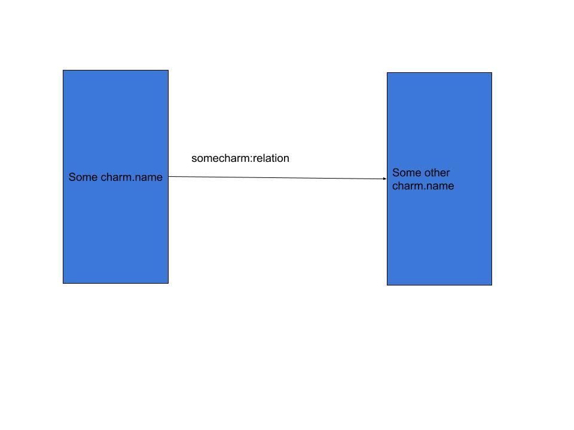
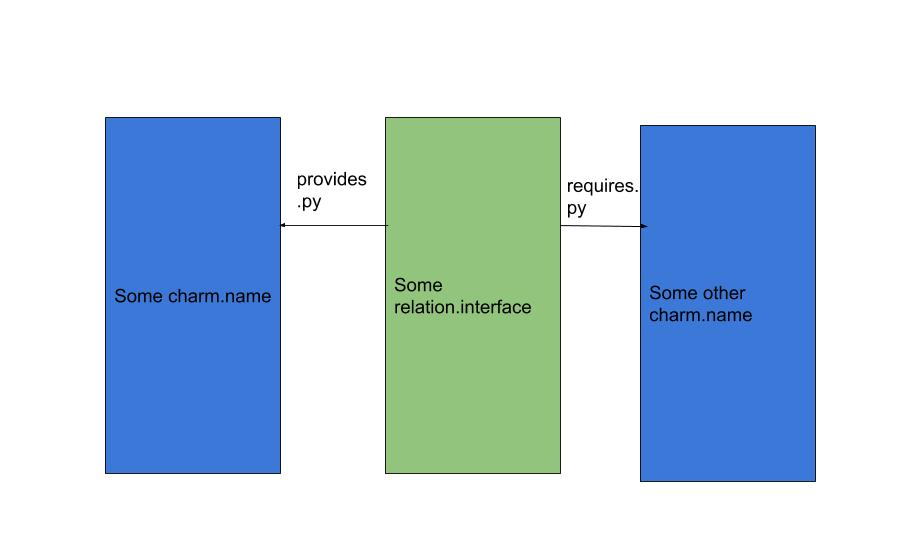
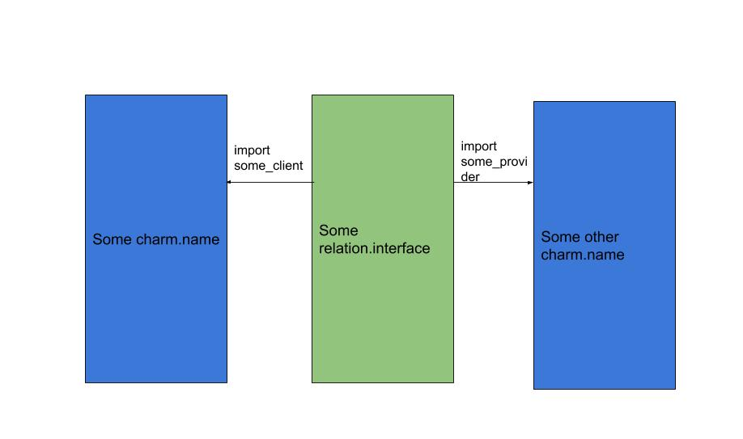

## New to charms?

> This covers aspects of charming which will be useful when creating them

### How do relations work?

Relations between charms at a high level work through what are called interfaces, interfaces are the glue that sticks two or more charms together and allows them to communicate.

#### Some history

In the old framework (reactive) charms were found on github, and used the naming convention of `interface-<interface-name>`. This stays with the new framework.

The major change is the removal of `requires.py` and `provides.py` these are now replaced by a simplied `interface_<interface_name>.py`.

Here's the picture you might have in when you think of charm relations:

The problem with this conception is what if want to create a new charm to use somecharm:relation, well then not only do I have to create a new charm, and program the relation into it, I __also__ have to adapt my original charm to work for my new charm. The two components are too closely coupled.

So the charm framework deals with this by decoupling the relations, this is where we move onto the next section.

#### What are Interfaces?

To decouple the charms from each other and provide abstract, easy to use relations, we have what are called Interfaces.

With the Operator Framework we introduce the new interfaces, but continuing with the previous theme, lets see how interfaces **used** to work in the old reactive framework.

You can see here that the interfaces provide the decoupling needed for two or more different charms to communicate with each other.

### How we do interfaces in the new framework

In the new framework we have a single file which handles this inter-charm information sharing.

These interfaces need a charm writing doc of their own (todo) the takeaway here is that there is a single import for both charms to be able to communicate with each other.

That's enough background for now, you can move onto Charm Writing in detail.