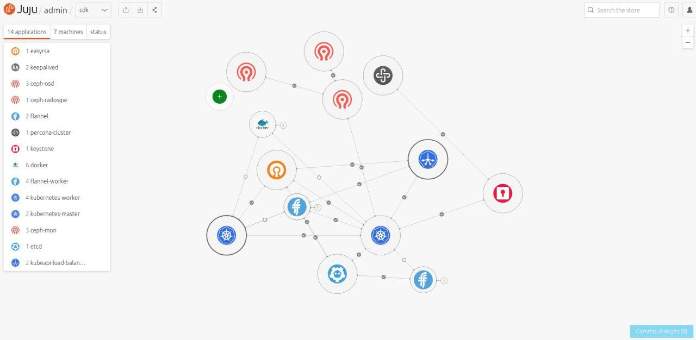

# Charms in detail
## Table of contents

[Best practices](##Best%20practice)

[Charm writing in detail](##Charm%20Writing%20in%20detail)

[New to charms?](##New%20to%20charms?)

[Charm Writing](#Charm%20writing)

[Example Charms](##Example%20Charms)

## Best practices

### Repoository Naming

Naming follows the convention of charm-<charm_name> for example `charm-percona-cluster`.

The rationale behind this is quick and easy searching of the 1000s of github projects along with other reasons.


## Charm Writing in detail

## New to charms?

> This covers aspects of charming which will be useful when creating them

### Why charms?

The objective of charms is the following: take the complication of managing 100s potentially 1000s of configuration files and abstract them as python modules. Thus by abstraction creating a true insfrastructure as code.

But charms are not just limited to setting up configuration, they also handle the installation of charms, and can implement actions thus providing not just configuration, but day zero to day two operations support.

One of the ways that charms achieves this goal is through what are called relations, you can think about this much like the Database relation charts you might have seen in previous roles, or at university, the concept is much the same.

Here's an example from the Juju GUI:



What you are looking at here is a Kubernetes, rendered, using Juju and charms. Each of the circles represents an application, each of the lines represents what we call a relation.

### How do relations work?

Relations between charms at a high level work through what are called interfaces, interfaces are the glue that sticks two or more charms together and allows them to communicate.

#### Some history

In the old framework (reactive) charms were found on github, and used the naming convention of `interface-<interface-name>`. This stays with the new framework.

The major change is the removal of `requires.py` and `provides.py` these are now replaced by a simplied `interface_<interface_name>.py`.

Here's the picture you might have in when you think of charm relations:


The problem with this conception is what if want to create a new charm to use somecharm:relation, well then not only do I have to create a new charm, and program the relation into it, I __also__ have to adapt my original charm to work for my new charm. The two components are too closely coupled.

So the charm framework deals with this by decoupling the relations, this is where we move onto the next section.

#### What are Interfaces?

To decouple the charms from each other and provide abstract, easy to use relations, we have what are called Interfaces.

With the Operator Framework we introduce the new interfaces, but continuing with the previous theme, lets see how interfaces **used** to work in the old reactive framework.


You can see here that the interfaces provide the decoupling needed for two or more different charms to communicate with each other.

### How we do interfaces in the new framework

In the new framework we have a single file which handles this inter-charm information sharing.

These interfaces need a charm writing doc of their own (todo) the takeaway here is that there is a single import for both charms to be able to communicate with each other.


That's enough background for now, you can move onto Charm Writing in detail.

## Charm writing

### Add the operator framework

To begin a new charm, you will need to import the operator framework. The charm operator framework is imported by adding the framework in the 'lib' diretory and as a submodule:

```
git submodule add https://github.com/canonical/operator mod/operator
ln -s ../mod/operator/ops lib/ops
```

### Add interface dependences

To begin a new charm we should take note of an Interfaces that might be needed, the operator framework uses Interfaces as dependencies.

These dependencies are pulled in as git submodules, and should be added to the `.gitmodules` file, an example file looks like this:

```

[submodule "mod/operator"]
	path = mod/operator
	url = https://github.com/canonical/operator
[submodule "mod/interface-mysql"]
	path = mod/interface-mysql
	url = git@github.com:johnsca/interface-mysql.git
[submodule "mod/interface-http"]
	path = mod/interface-http
	url = git@github.com:johnsca/interface-http.git
[submodule "mod/resource-oci-image"]
	path = mod/resource-oci-image
	url = git@github.com:johnsca/resource-oci-image.git
```

You can then pull in those dependencies with the following commands:

```
git submodule init
git submodule update
```

These commands will pull in the dependencies to mod, although we will be referencing from the `lib` directory. To fix this you will need to create symbolic references.

```
ln -s ./mod/interface-mysql/interface_mysql.py ./lib/interface_mysql.py
```

This is requied for all of the required submodules.

> You can learn more about writing Interfaces [here](./CharmInterfaces.md)

## Imports

The operator charms are invoked as scripts on the running machine. As such you will be required to add a shbang at the top of the python file:

```
#!/usr/bin/env python3
```

After this, you will then need to adapt the system path to import the framework:

```
import sys
sys.path.append('lib')
```

Once this is done, you can then move on to import the Framework classes

```
from ops.charm import CharmBase
from ops.main import main
from ops.framework import StoredState
from oci_image import OCIImageResource
```

Followed by any other imports, for example, interfaces:

```
from interface_mysql import MySQLClient
```

## Creating the charm class

All Operator Framework charms should inherit from the `CharmBase` class. This gives them access to the internals

For example:

```
class MyCharm(CharmBase):
```

### The charm `__init__` method

The charm __init__ method has the following signature:

```
def __init__(self, framework, key)
             ^^^^  ^^^^^^^^^  ^^^
             ||||  |||||||||  ||||

 1. Obvious!       |||||||||  ||||
 2.      A reference to the framework
                              ||||
 3.                           key (described below)

```

Number 3. Is yet unused in the framework.

Once you have the above `__init__` signature. You will need to call super:

```
    def __init__(self, framework, key):
        super.__init__(framework, key)
```

You can then follow up the rest of the method with calls to set our state and our required interfaces for example:

```
        self.state.set_defaults(is_started=False)
        self.mysql = MySQLClient(self, 'mysql')
```

### The charm model

This is the central place to get all relevant charm information so that you can configure your charm.

The charm model has the following properties:

- unit
- app
- relations - A relation mapping
- config - The charm configuration
- resources
- pod - the Kubernetes pod
- storages - The charm storage (A PVC?)

Charm metadata is retrieved from the meta framework attribute:

```
meta = self.framework.meta
```

The same can be done for the charm configuration data too:

```
config = self.framework.config
```

### Hooking into events

In the `__init__` call you can setup events to be called, for example when the database is available:

```
	self.framework.observe(
		self.mysql.on.database_available,
		self.configure_pod
	)
```

A popular event to track in the framework is the `config_changed` event:

```
	self.framework.observe(self.on.config_changed, self.configure_pod)
```

> To get a list of events for an interface you will need to check the docs of that interface. For framework events see [here](./frameworkevents.md)

Your event listener methods should accept the event as an arguement. The required signature is below:

```
def my_event_listener(self, event):
    pass
```

You are able to add additional params if you so wish but they __must__ be optional, otherwise a `TypeError` will be thrown.

#### Deferring events

In the new framework events can now be deferred. When an event is deferred:

- Parameters will be saved when events are deferred;
- Parameters will be restored when events are reemitted;

To defer an event, all you need to is called `defer()`. An example of this can be found below:

```
def on_db_peer_relation_changed(self, event):
    if not self.state.ready:
        event.defer()
        return
```

> NOTE: ActionEvents cannot be deferred. Doing so will trigger a `RuntimeError`.

## Subordinate Charms


## Charm Actions

TODO

## Migrating from the old (reactive) framework

TODO

## Testing

Please find the testing guide [here](./Testing.md)

# Useful links

TODO

## Example Charms

[Gitlab charm](https://github.com/johnsca/charm-gitlab-k8s)

[Cockroachdb (Example Charm)](https://github.com/dshcherb/charm-cockroachdb)

[Charm Kine](https://github.com/tvansteenburgh/charm-kine)

[Test Charm (From the Operator Framework)](https://github.com/canonical/operator/tree/master/test/charms/test_main)

[MSSQL Charm](https://github.com/camille-rodriguez/mssql)