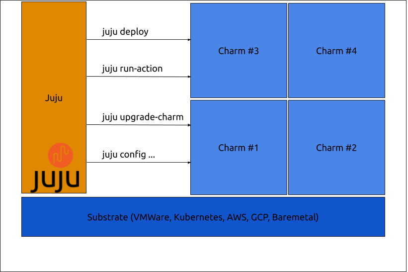

# Getting Started

## Table of contents

[Introduction](##Introduction)

[Charm Creation](##Charm%20Creation)

## Introduction

### Juju and Charms

The Charm Operator Framework is the companion to [Juju](https://jaas.ai/docs/what-is-juju) charms are the workers, and juju is the orchestrator, together they encapsulate the complexity of Day zero through to day three operations away from the user making infrastructure as a code a reality.

The charm operator framework was created to answer this not just for VM/Baremetal scenario but for containers also.

Here is a diagram of how juju and charms work together:



## Charm Creation Quick Start

There are currently two types of Charm, IAAS charms and Kubernetes (K8s) charms.

### Creating your first charm

To  charm directory should have the following overall structure:

```
.
+-- metadata.yaml
+-- mod/
+-- lib/
|   +-- ops -> ../mod/operator/ops
+-- src/
|   +-- charm.py
+-- hooks/
    +-- install -> ../src/charm.py
```

The `mod/` directory will contain the operator framework dependency as a git
submodule:

```
git submodule add https://github.com/canonical/operator mod/operator
```

Other dependencies included as git submodules can be added there as well.

The `lib/` directory will then contain symlinks to subdirectories of your
submodule dependencies to enable them to be imported into the charm:

```
ln -s ../mod/operator/ops lib/ops
```

Your `src/charm.py` is the entry point for your charm logic. It should be set
to executable and use Python 3.6 or greater. At a minimum, it needs to define a
subclass of `CharmBase` and pass that into the framework's `main` function:

```python
import sys
sys.path.append('lib')

from ops.charm import CharmBase
from ops.main import main

class MyCharm(CharmBase):
    pass


if __name__ == "__main__":
    main(MyCharm)
```

This charm does nothing, though, so you'll typically want to observe some Juju
events, such as `start`:

```python
class MyCharm(CharmBase):
    def __init__(self, *args):
        super().__init__(*args)
        self.framework.observe(self.on.start, self.on_start)

     def on_start(self, event):
        # Handle the event here.
```

Every standard event in Juju may be observed that way, and you can also easily
define your own events in your custom types.


The `hooks/` directory will then contain symlinks to your `src/charm.py` entry
point so that Juju can call it. You only need to set up the `hooks/install` link
(`hooks/start` for K8s charms, until [lp#1854635](https://bugs.launchpad.net/juju/+bug/1854635)
is resolved), and the framework will fill out all others at runtime.

Once your charm is ready, deploy it as normal with:

```
juju deploy .
```

You can sync subsequent changes from the framework and other submodule
dependencies by running:

```
git submodule update
```
## More Links

[Charms in detail](./charmsindetail.md)