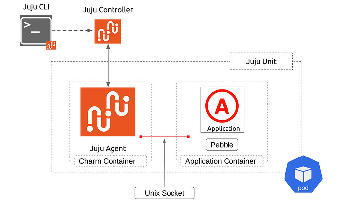

(create-a-minimal-kubernetes-charm)=
# Create a minimal Kubernetes charm

> <small> {ref}`From Zero to Hero: Write your first Kubernetes charm <from-zero-to-hero-write-your-first-kubernetes-charm>` > Create a minimal Kubernetes charm</small>
>
> **See previous: {ref}`Set up your development environment <set-up-your-development-environment>`**

When you deploy a Kubernetes charm, the following things happen:

1. The Juju controller provisions a pod with at least two containers, one for the Juju unit agent and the charm itself and one container for each application workload container that is specified in the `containers` field of a file in the charm that is called `charmcraft.yaml`.
1. The same Juju controller injects Pebble -- a lightweight, API-driven process supervisor -- into each workload container and overrides the container entrypoint so that Pebble starts when the container is ready.
1. When the Kubernetes API reports that a workload container is ready, the Juju controller informs the charm that the instance of Pebble in that container is ready. At that point, the charm knows that it can start communicating with Pebble.
1. Typically, at this point the charm will make calls to Pebble so that Pebble can configure and start the workload and begin operations.

> Note: In the past, the containers were specified in a `metadata.yaml` file, but the modern practice is that all charm specification is in a single `charmcraft.yaml` file.

All subsequent workload management happens in the same way -- the Juju controller sends events to the charm and the charm responds to these events by managing the workload application in various ways via Pebble. The picture below illustrates all of this for a simple case where there is just one workload container.





As a charm developer, your first job is to use this knowledge to create the basic structure and content for your charm:

 - descriptive files (e.g., YAML configuration files like the `charmcraft.yaml` file mentioned above) that give Juju, Python, or Charmcraft various bits of information about your charm, and
- executable files (like the `src/charm.py` file that we will see shortly) where you will use Ops-enriched Python to write all the logic of your charm.

## Create a charm project

In your virtual machine, go into your project directory and create the initial version of your charm:

```text
cd ~/fastapi-demo
charmcraft init --profile kubernetes
```

Charmcraft created several files, including:

- `charmcraft.yaml` - Metadata about your charm. Used by Juju and Charmcraft.
- `pyproject.toml` - Python project configuration. Lists the dependencies of your charm.
- `src/charm.py` - The Python file that will contain the logic of your charm.

These files currently contain placeholder code and configuration.

## Write your charm

### Edit the metadata

Open `~/k8s-tutorial/charmcraft.yaml` in your usual text editor or IDE, then change the values of `title`, `summary`, and `description` to:

```yaml
title: Web Server Demo
summary: A demo charm that operates a small Python FastAPI server.
description: |
  This charm demonstrates how to write a Kubernetes charm with Ops.
```

Next, describe the workload container and its OCI image.

In `charmcraft.yaml`, replace the `containers` and `resources` blocks with:

```yaml
containers:
  demo-server:
    resource: demo-server-image

resources:
  # An OCI image resource for the container listed above.
  demo-server-image:
    type: oci-image
    description: OCI image from GitHub Container Repository
    # The upstream-source field is ignored by Charmcraft and Juju, but it can be
    # useful to developers in identifying the source of the OCI image.  It is also
    # used by the 'canonical/charming-actions' GitHub action for automated releases.
    # The test_deploy function in tests/integration/test_charm.py reads upstream-source
    # to determine which OCI image to use when running the charm's integration tests.
    upstream-source: ghcr.io/canonical/api_demo_server:1.0.2
```

### Define the charm class

We'll now write the charm code that handles events from Juju. Charmcraft created `src/charm.py` as the location for this logic.

Replace the contents of `src/charm.py` with:

```python
#!/usr/bin/env python3

"""Kubernetes charm for a demo app."""

import ops


class FastAPIDemoCharm(ops.CharmBase):
    """Charm the service."""

    def __init__(self, framework: ops.Framework) -> None:
        super().__init__(framework)


if __name__ == "__main__":  # pragma: nocover
    ops.main(FastAPIDemoCharm)
```

As you can see, a charm is a pure Python class that inherits from the [`CharmBase`](ops.CharmBase) class of Ops and which we pass to [](ops.main). We'll refer to `FastAPIDemoCharm` as the "charm class".

### Handle the pebble-ready event

In the `__init__` function of your charm class, we'll tell Ops which method of your charm class to run for each event. Let's start with when the Juju controller tells us that the workload container's Pebble is up and running.

```python
framework.observe(self.on["demo-server"].pebble_ready, self._on_demo_server_pebble_ready)
```


```{important}

**Generally speaking:** A charm class is a collection of event handling methods. When you want to install, remove, upgrade, configure, etc., an application, Juju sends information to your charm. Ops translates this information into events and your job is to write event handlers

```

```{tip}

**Pro tip:** Use `__init__` to hold references (pointers) to other `Object`s or immutable state only. That is because a charm is reinitialised on every event. You can't persist data between Juju events by storing it in memory.

```

Next, define the event handler, as follows:

We'll use the `ActiveStatus` class to set the charm status to active. Note that almost everything you need to define your charm is in the `ops` package that you imported earlier - there's no need to add additional imports.

Use `ActiveStatus` as well as further Ops constructs to define the event handler, as below. As you can see, what is happening is that, from the `event` argument, you extract the workload container object in which you add a custom layer. Once the layer is set you replan your service and set the charm status to active.


```python
def _on_demo_server_pebble_ready(self, event: ops.PebbleReadyEvent) -> None:
    """Define and start a workload using the Pebble API."""
    # Get a reference the container attribute on the PebbleReadyEvent
    container = event.workload
    # Add initial Pebble config layer using the Pebble API
    container.add_layer("fastapi_demo", self._get_pebble_layer(), combine=True)
    # Make Pebble reevaluate its plan, ensuring any services are started if enabled.
    container.replan()
    # Learn more about statuses at
    # https://documentation.ubuntu.com/juju/3.6/reference/status/
    self.unit.status = ops.ActiveStatus()
```

The custom Pebble layer that you just added is defined in the  `self._get_pebble_layer()` method. We'll now add this method.

In the `__init__` method of your charm class, name your service to `fastapi-service` and add it as a class attribute:

```python
self.pebble_service_name = "fastapi-service"
```

Finally, define  the `_get_pebble_layer` function as below. The `command` variable represents a command line that should be executed in order to start our application.

```python
def _get_pebble_layer(self) -> ops.pebble.Layer:
    """Pebble layer for the FastAPI demo services."""
    command = " ".join(
        [
            "uvicorn",
            "api_demo_server.app:app",
            "--host=0.0.0.0",
            "--port=8000",
        ]
    )
    pebble_layer: ops.pebble.LayerDict = {
        "summary": "FastAPI demo service",
        "description": "pebble config layer for FastAPI demo server",
        "services": {
            self.pebble_service_name: {
                "override": "replace",
                "summary": "fastapi demo",
                "command": command,
                "startup": "enabled",
            }
        },
    }
    return ops.pebble.Layer(pebble_layer)
```

### Add logger functionality

In the imports section of `src/charm.py`, import the Python `logging` module and define a logger object, as below. This will allow you to read log data in `juju`.

```python
import logging

# Log messages can be retrieved using juju debug-log
logger = logging.getLogger(__name__)
```

## Try your charm

### Pack your charm

Now go back to your virtual machine and make sure that you're in the `~/fastapi-demo` directory.

Then run `charmcraft pack` to create a `.charm` file that can be deployed with Juju. In our case, the file was named `fastapi-demo_amd64.charm`. Yours should be named similarly, though the name might vary slightly depending on your architecture.

```
charmcraft pack
# Packed fastapi-demo_amd64.charm
```

The first time you run `charmcraft pack`, Charmcraft takes several minutes to pack your charm. Packing will be faster the next time because Charmcraft has cached the packing environment.

If you run into inexplicable issues when running `charmcraft pack`, this may be because some of the cached information is out of date. Run `charmcraft clean` to fix this.

```{important}

**Did you know?** A `.charm` file is really just a zip file of your charm files and code dependencies that makes it more convenient to share, publish, and retrieve your charm contents.

```

### Deploy your charm

Deploy the `.charm` file, as below. Juju will create a Kubernetes `StatefulSet` named after your application with one replica.

```text
juju deploy ./fastapi-demo_amd64.charm --resource \
     demo-server-image=ghcr.io/canonical/api_demo_server:1.0.2
```


```{important}

**If you've never deployed a local charm (i.e., a charm from a location on your machine) before:** <br> As you may know, when you deploy a charm from Charmhub it is sufficient to run `juju deploy <charm name>`. However, to deploy a local charm you need to explicitly define a `--resource` parameter with the same resource name and resource upstream source as in the `charmcraft.yaml`.

```


Monitor your deployment:

```text
juju status --watch 1s
```

When all units are settled down, you should see the output below, where `10.152.183.215` is the IP of the K8s Service and `10.1.157.73` is the IP of the pod.

```text
Model    Controller     Cloud/Region  Version  SLA          Timestamp
testing  concierge-k8s  k8s           3.6.13   unsupported  13:38:19+01:00

App           Version  Status  Scale  Charm         Channel  Rev  Address         Exposed  Message
fastapi-demo           active      1  fastapi-demo             0  10.152.183.215  no

Unit             Workload  Agent  Address      Ports  Message
fastapi-demo/0*  active    idle   10.1.157.73
```

### Try the web server

Validate that the app is running and reachable by sending an HTTP  request as below, where `10.1.157.73` is the IP of our pod and `8000` is the default application port.

```
curl 10.1.157.73:8000/version
```

You should see a JSON string with the version of the application:

```
{"version":"1.0.2"}
```

Congratulations, you've successfully created a minimal Kubernetes charm!

### Inspect your deployment further

1. Run:

```text
kubectl get namespaces
```

You should see that Juju has created a namespace called `testing`.

2. Try:

```text
kubectl -n testing get pods
```

You should see that your application has been deployed in a pod that has 2 containers running in it, one for the charm and one for the application. The containers talk to each other via the Pebble API using the UNIX socket.

```text
NAME                             READY   STATUS    RESTARTS   AGE
modeloperator-5df6588d89-ghxtz   1/1     Running   0          10m
fastapi-demo-0                   2/2     Running   0          10m
```

3. Check also:

```text
kubectl -n testing describe pod fastapi-demo-0
```

In the output you should see the definition for both containers. You'll be able to verify that the default command and arguments for our application container (`demo-server`) have been displaced by the Pebble service. You should be able to verify the same for the charm container (`charm`).

(write-unit-tests-for-your-charm)=
## Write unit tests for your charm

When you're writing a charm, you will want to ensure that it will behave as intended.

For example, you'll want to check that the various components -- relation data, Pebble services, or configuration files -- all behave as expected in response to an event.

You can ensure all this by writing a rich battery of unit tests. In the context of a charm, we recommended using [`pytest`](https://pytest.org/) ([`unittest`](https://docs.python.org/3/library/unittest.html) can also be used) with [](ops_testing), the framework for state-transition testing in Ops.

We'll also use the Python testing tool [`tox`](https://tox.wiki/en/4.14.2/index.html) to automate our testing and set up our testing environment.

In this section we'll write a test to check that Pebble is configured as expected.

### Write a test

Replace the contents of `tests/unit/test_charm.py` with:

```python
import ops
from ops import testing

from charm import FastAPIDemoCharm


def test_pebble_layer():
    ctx = testing.Context(FastAPIDemoCharm)
    container = testing.Container(name="demo-server", can_connect=True)
    state_in = testing.State(
        containers={container},
        leader=True,
    )
    state_out = ctx.run(ctx.on.pebble_ready(container), state_in)
    # Expected plan after Pebble ready with default config
    expected_plan = {
        "services": {
            "fastapi-service": {
                "override": "replace",
                "summary": "fastapi demo",
                "command": "uvicorn api_demo_server.app:app --host=0.0.0.0 --port=8000",
                "startup": "enabled",
                # Since the environment is empty, Layer.to_dict() will not
                # include it.
            }
        }
    }

    # Check that we have the plan we expected:
    assert state_out.get_container(container.name).plan == expected_plan
    # Check the unit is active:
    assert state_out.unit_status == testing.ActiveStatus()
    # Check the service was started:
    assert (
        state_out.get_container(container.name).service_statuses["fastapi-service"]
        == ops.pebble.ServiceStatus.ACTIVE
    )
```

This test checks the behaviour of the `_on_demo_server_pebble_ready` function that you set up earlier. The test simulates your charm receiving the pebble-ready event, then checks that the unit and workload container have the correct state.

### Run the test

Run the following command from anywhere in the `~/fastapi-demo` directory:

```text
tox -e unit
```

The result should be similar to the following output:

```text
...
============================================ test session starts =============================================
platform linux -- Python 3.12.3, pytest-8.4.1, pluggy-1.6.0 -- /home/ubuntu/fastapi-demo/.tox/unit/bin/python3
cachedir: .tox/unit/.pytest_cache
rootdir: /home/ubuntu/fastapi-demo
configfile: pyproject.toml
collected 1 item

tests/unit/test_charm.py::test_pebble_layer PASSED

============================================= 1 passed in 0.54s ==============================================
unit: commands[1]> coverage report
Name                  Stmts   Miss Branch BrPart  Cover   Missing
-----------------------------------------------------------------
src/charm.py             17      0      0      0   100%
src/fastapi_demo.py       4      4      0      0     0%   9-20
-----------------------------------------------------------------
TOTAL                    21      4      0      0    81%
  unit: OK (1.91=setup[0.09]+cmd[1.54,0.28] seconds)
  congratulations :) (1.93 seconds)
```

Congratulations, you have written your first unit test!


(write-integration-tests-for-your-charm)=
## Write integration tests for your charm

A charm should function correctly not just in a mocked environment, but also in a real deployment.

For example, it should be able to pack, deploy, and integrate without throwing exceptions or getting stuck in a `waiting` or a `blocked` status -- that is, it should correctly reach a status of `active` or `idle`.

You can ensure this by writing integration tests for your charm. In the charming world, these are usually written with the [`jubilant`](https://documentation.ubuntu.com/jubilant/) library.

In this section we'll write a small integration test to check that the charm packs and deploys correctly.

### Write a test

Let's write the simplest possible integration test, a [smoke test](https://en.wikipedia.org/wiki/Smoke_testing_(software)). This test will deploy the charm, then verify that the installation event is handled without errors.

Replace the contents of `tests/integration/test_charm.py` with:

```python
import logging
import pathlib

import jubilant
import yaml

logger = logging.getLogger(__name__)

METADATA = yaml.safe_load(pathlib.Path("charmcraft.yaml").read_text())
APP_NAME = METADATA["name"]


def test_deploy(charm: pathlib.Path, juju: jubilant.Juju):
    """Deploy the charm under test."""
    resources = {
        "demo-server-image": METADATA["resources"]["demo-server-image"]["upstream-source"]
    }
    juju.deploy(charm.resolve(), app=APP_NAME, resources=resources)
    juju.wait(jubilant.all_active)
```

This test depends on two fixtures, which are defined in `tests/integration/conftest.py`:

- `charm` - The `.charm` file to deploy.
- `juju` - A Jubilant object for interacting with a temporary Juju model.

### Run the test

Run the following command from anywhere in the `~/fastapi-demo` directory:

```text
tox -e integration
```

The test takes some time to run as Jubilant adds a new model to an existing cluster (whose presence it assumes). If successful, it'll verify that your charm can pack and deploy as expected.

The result should be similar to the following output:

```text
...

============================= 1 passed in 55.43s =============================
  integration: OK (57.79=setup[0.23]+cmd[57.57] seconds)
  congratulations :) (57.84 seconds)
```

```{tip}
`tox -e integration` doesn't pack your charm. If you modify the charm code and want to run the integration tests again, run `charmcraft pack` before `tox -e integration`.
```

## Review the final code

For the full code, see [our example charm for this chapter](https://github.com/canonical/operator/tree/main/examples/k8s-1-minimal).

>**See next: {ref}`Make your charm configurable <make-your-charm-configurable>`**
