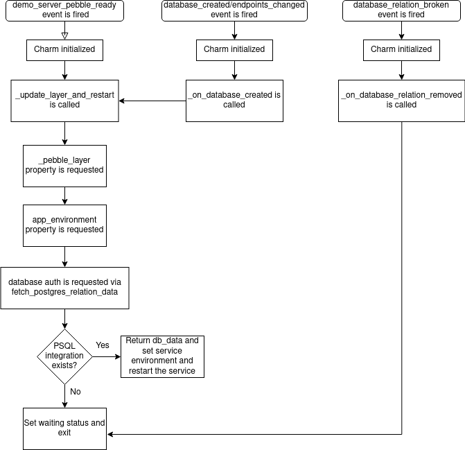

(integrate-your-charm-with-postgresql)=
# Integrate your charm with PostgreSQL

> <small> {ref}`From Zero to Hero: Write your first Kubernetes charm <from-zero-to-hero-write-your-first-kubernetes-charm>` > Integrate your charm with PostgreSQL</small>
>
> **See previous: {ref}`Expose the version of the application behind your charm <expose-the-version-of-the-application-behind-your-charm>`** 

````{important}

This document is part of a  series, and we recommend you follow it in sequence.  However, you can also jump straight in by checking out the code from the previous branches:


```text
git clone https://github.com/canonical/juju-sdk-tutorial-k8s.git
cd juju-sdk-tutorial-k8s
git checkout 03_set_workload_version
git checkout -b 04_integrate_with_psql 
```

````

A charm often requires or supports relations to other charms. For example, to make our application fully functional we need to connect it to the PostgreSQL database. In this chapter of the tutorial we will update our charm so that it can be integrated with the existing [PostgreSQL charm](https://charmhub.io/postgresql-k8s?channel=14/stable).


## Fetch the required database interface charm libraries

Navigate to your charm directory and fetch the [data_interfaces](https://charmhub.io/data-platform-libs/libraries/data_interfaces) charm library from Charmhub:

```
ubuntu@charm-dev:~/fastapi-demo$ charmcraft fetch-lib charms.data_platform_libs.v0.data_interfaces
```

Your charm directory should now contain the structure below:

```text
lib
└── charms
    └── data_platform_libs
        └── v0
            └── data_interfaces.py
```

Well done, you've got everything you need to set up a database relation!


## Define the charm relation interface

<!--
Charm relation interfaces are described in the `charmcraft.yaml` file. To connect to the PostgreSQL charm, we will need to find out the name of the interface that PostgreSQL exposes so other charms can connect to it and then update our `charmcraft.yaml` file.
-->

Now, time to define the charm relation interface.

First, find out the name of the interface that PostgreSQL offers for other charms to connect to it. According to the [documentation of the PostgreSQL charm](https://charmhub.io/postgresql-k8s?channel=14/stable), the interface is called `postgresql_client`.

Next, open the `charmcraft.yaml` file of your charm and, before the `containers` section, define a relation endpoint using a `requires` block, as below. This endpoint says that our charm is requesting a relation called `database` over an interface called `postgresql_client` with a maximum number of supported connections of 1. (Note: Here, `database` is a custom relation name, though in general we recommend sticking to default recommended names for each charm.)

```yaml
requires:
  database:
    interface: postgresql_client
    limit: 1
```

That will tell `juju` that our charm can be integrated with charms that provide the same `postgresql_client` interface, for example, the official PostgreSQL charm.


Import the database interface libraries and define database event handlers

We now need to implement the logic that wires our application to a database. When a relation between our application and the data platform is formed, the provider side (i.e., the data platform) will create a database for us and it will provide us with all the information we need to connect to it over the relation -- e.g., username, password, host, port, etc. On our side, we nevertheless still need to set the relevant environment variables to point to the database and restart the service.

To do so, we need to update our charm “src/charm.py” to do all of the following:

* Import the `DataRequires` class from the interface library; this class represents the relation data exchanged in the client-server communication.
* Define the event handlers that will be called during the relation lifecycle.
* Bind the event handlers to the observed relation events.

### Import the database interface libraries


First, at the top of the file, import the database interfaces library:

```python
# Import the 'data_interfaces' library.
# The import statement omits the top-level 'lib' directory 
# because 'charmcraft pack' copies its contents to the project root.
from charms.data_platform_libs.v0.data_interfaces import DatabaseCreatedEvent
from charms.data_platform_libs.v0.data_interfaces import DatabaseRequires
```

````{important}

You might have noticed that despite the charm library being placed in the `lib/charms/...`, we are importing it via:

```python
from charms.data_platform_libs ...
```
and not

```python
from lib.charms.data_platform_libs...
```

The former is not resolvable by default but everything works fine when the charm is deployed. Why? Because the `dispatch` script in the packed charm sets the `PYTHONPATH` environment variable to include the `lib` directory when it executes your `src/charm.py` code. This tells python it can check the `lib` directory when looking for modules and packages at import time. 


If you're experiencing issues with your IDE or just trying to run the `charm.py` file on your own, make sure to set/update `PYTHONPATH` to include `lib` directory as well.

```bash
# from the charm project directory (~/fastapi-demo), set
export PYTHONPATH=lib
# or update
export PYTHONPATH=lib:$PYTHONPATH
```

````


### Add relation event observers

Next, in the `__init__` method, define a new instance of the 'DatabaseRequires' class. This is required to set the right permissions scope for the PostgreSQL charm. It will create a new user with a password and a database with the required name (below, `names_db`), and limit the user permissions to only this particular database (that is, below, `names_db`).
  

```python
# The 'relation_name' comes from the 'charmcraft.yaml file'.
# The 'database_name' is the name of the database that our application requires. 
# See the application documentation in the GitHub repository.
self.database = DatabaseRequires(self, relation_name="database", database_name="names_db")
```

Now, add event observers for all the database events:

```python
# See https://charmhub.io/data-platform-libs/libraries/data_interfaces
framework.observe(self.database.on.database_created, self._on_database_created)
framework.observe(self.database.on.endpoints_changed, self._on_database_created)
```

### Fetch the database authentication data

Now we need to extract the database authentication data and endpoints information. We can do that by adding a `fetch_postgres_relation_data` method to our charm class. Inside this method, we first retrieve relation data from the PostgreSQL using the `fetch_relation_data`  method of the `database` object. We then log the retrieved data for debugging purposes. Next we process any non-empty data to extract endpoint information, the username, and the password and return this process data as a dictionary. Finally, we ensure that, if no data is retrieved, we return an empty dictionary, so that the caller knows that the database is not yet ready.

```python
def fetch_postgres_relation_data(self) -> Dict[str, str]:
    """Fetch postgres relation data.

    This function retrieves relation data from a postgres database using
    the `fetch_relation_data` method of the `database` object. The retrieved data is
    then logged for debugging purposes, and any non-empty data is processed to extract
    endpoint information, username, and password. This processed data is then returned as
    a dictionary. If no data is retrieved, the unit is set to waiting status and
    the program exits with a zero status code."""
    relations = self.database.fetch_relation_data()
    logger.debug('Got following database data: %s', relations)
    for data in relations.values():
        if not data:
            continue
        logger.info('New PSQL database endpoint is %s', data['endpoints'])
        host, port = data['endpoints'].split(':')
        db_data = {
            'db_host': host,
            'db_port': port,
            'db_username': data['username'],
            'db_password': data['password'],
        }
        return db_data
    return {}
```

Since `ops` supports Python 3.8, this tutorial used type annotations compatible with 3.8. If you're following along with this chapter, you'll need to import the following from the `typing` module:
```python
from typing import Dict, Optional
```
```{important}

The version of Python that your charm will use is determined in your `charmcraft.yaml`. In this case, we've specified Ubuntu 22.04, which means the charm will actually be running on Python 3.10, so we could have used some more recent Python features, like using the builtin `dict` instead of `Dict`, and the `|` operator for unions, allowing us to write (e.g.) `str | None` instead of `Optional[str]`. This will likely be updated in a future version of this tutorial.

```


### Share the authentication information with your application

Our application consumes database authentication information in the form of environment variables. Let's update the Pebble service definition with an `environment` key and let's set this key to a dynamic value --  the class property `self.app_environment`. Your `_pebble_layer` property should look as below:

```python
    @property
    def _pebble_layer(self) -> ops.pebble.Layer:
        """A Pebble layer for the FastAPI demo services."""
        command = ' '.join(
            [
                'uvicorn',
                'api_demo_server.app:app',
                '--host=0.0.0.0',
                f"--port={self.config['server-port']}",
            ]
        )
        pebble_layer: ops.pebble.LayerDict = {
            'summary': 'FastAPI demo service',
            'description': 'pebble config layer for FastAPI demo server',
            'services': {
                self.pebble_service_name: {
                    'override': 'replace',
                    'summary': 'fastapi demo',
                    'command': command,
                    'startup': 'enabled',
                    'environment': self.app_environment,
                }
            },
        }
        return ops.pebble.Layer(pebble_layer)
```

Now, let's define this property such that, every time it is called, it dynamically fetches database authentication data and also prepares the output in a form that our application can consume, as below:

```python
@property
def app_environment(self) -> Dict[str, Optional[str]]:
    """This property method creates a dictionary containing environment variables
    for the application. It retrieves the database authentication data by calling
    the `fetch_postgres_relation_data` method and uses it to populate the dictionary.
    If any of the values are not present, it will be set to None.
    The method returns this dictionary as output.
    """
    db_data = self.fetch_postgres_relation_data()
    if not db_data:
        return {}
    env = {
        'DEMO_SERVER_DB_HOST': db_data.get('db_host', None),
        'DEMO_SERVER_DB_PORT': db_data.get('db_port', None),
        'DEMO_SERVER_DB_USER': db_data.get('db_username', None),
        'DEMO_SERVER_DB_PASSWORD': db_data.get('db_password', None),
    }
    return env
```

Finally, let's define the method that is called on the database created event:

```python
def _on_database_created(self, event: DatabaseCreatedEvent) -> None:
    """Event is fired when postgres database is created."""
    self._update_layer_and_restart()
```

The diagram below illustrates the workflow for the case where the database relation exists and for the case where it does not:

 


## Update the unit status to reflect the relation state

Now that the charm is getting more complex, there are many more cases where the unit status needs to be set. It's often convenient to do this in a more declarative fashion, which is where the collect-status event can be used.

> Read more: [](ops.CollectStatusEvent)

In your charm's `__init__` add a new observer:

```python
framework.observe(self.on.collect_unit_status, self._on_collect_status)
```

And define a method that does the various checks, adding appropriate statuses. The library will take care of selecting the 'most significant' status for you.

```python
def _on_collect_status(self, event: ops.CollectStatusEvent) -> None:
    port = self.config['server-port']
    if port == 22:
        event.add_status(ops.BlockedStatus('Invalid port number, 22 is reserved for SSH'))
    if not self.model.get_relation('database'):
        # We need the user to do 'juju integrate'.
        event.add_status(ops.BlockedStatus('Waiting for database relation'))
    elif not self.database.fetch_relation_data():
        # We need the charms to finish integrating.
        event.add_status(ops.WaitingStatus('Waiting for database relation'))
    try:
        status = self.container.get_service(self.pebble_service_name)
    except (ops.pebble.APIError, ops.ModelError):
        event.add_status(ops.MaintenanceStatus('Waiting for Pebble in workload container'))
    else:
        if not status.is_running():
            event.add_status(ops.MaintenanceStatus('Waiting for the service to start up'))
    # If nothing is wrong, then the status is active.
    event.add_status(ops.ActiveStatus())
```

We also want to clean up the code to remove the places where we're setting the status outside of this method, other than anywhere we're wanting a status to show up *during* the event execution (such as `MaintenanceStatus`). In `_on_config_changed`, change the port 22 check to:

```python
    if port == 22:
        # The collect-status handler will set the status to blocked.
        logger.debug('Invalid port number, 22 is reserved for SSH;)
```

And remove the `self.unit.status = WaitingStatus` line from `_update_layer_and_restart` (similarly replacing it with a logging line if you prefer).

## Validate your charm


Time to check the results!

First, repack and refresh your charm:

```text
charmcraft pack
juju refresh \
  --path="./demo-api-charm_ubuntu-22.04-amd64.charm" \
  demo-api-charm --force-units --resource \
  demo-server-image=ghcr.io/canonical/api_demo_server:1.0.1
```

Next, deploy the `postgresql-k8s` charm:

```text
juju deploy postgresql-k8s --channel=14/stable --trust
```

Now,  integrate our charm with the newly deployed `postgresql-k8s` charm:

```text
juju integrate postgresql-k8s demo-api-charm
```

> Read more: {external+juju:ref}`Juju | Relation (integration) <relation>`, [`juju integrate`](inv:juju:std:label#command-juju-integrate)


Finally, run:

```text
juju status --relations --watch 1s
```

You should see both applications get to the `active` status, and also that the `postgresql-k8s` charm has a relation to the `demo-api-charm` over the `postgresql_client` interface, as below:

```text
Model        Controller           Cloud/Region        Version  SLA          Timestamp
charm-model  tutorial-controller  microk8s/localhost  3.0.0    unsupported  13:50:39+01:00

App             Version  Status  Scale  Charm           Channel  Rev  Address         Exposed  Message
demo-api-charm  0.0.9    active      1  demo-api-charm             1  10.152.183.233  no       
postgresql-k8s           active      1  postgresql-k8s  14/stable      29  10.152.183.195  no       Primary

Unit               Workload  Agent  Address      Ports  Message
demo-api-charm/0*  active    idle   10.1.157.90         
postgresql-k8s/0*  active    idle   10.1.157.92         Primary

Relation provider              Requirer                       Interface          Type     Message
postgresql-k8s:database        demo-api-charm:database        postgresql_client  regular  
postgresql-k8s:database-peers  postgresql-k8s:database-peers  postgresql_peers   peer     
postgresql-k8s:restart         postgresql-k8s:restart         rolling_op         peer 
```

The relation appears to be up and running, but we should also test that it's working as intended. First, let's try to write something to the database by posting some name to the database via API using `curl` as below -- where `10.1.157.90` is a pod IP and `8000` is our app port. You can repeat the command for multiple names. 

```text
curl -X 'POST' \
  'http://10.1.157.90:8000/addname/' \
  -H 'accept: application/json' \
  -H 'Content-Type: application/x-www-form-urlencoded' \
  -d 'name=maksim'
```

```{important}

If you changed the `server-port` config value in the previous section, don't forget to change it back to 8000 before doing this!

```

Second, let's try to read something from the database by running:

```text
curl 10.1.157.90:8000/names
```

This should produce something similar to the output below (of course, with the names that *you* decided to use):

```text
{"names":{"1":"maksim","2":"simon"}}
```

Congratulations, your relation with PostgreSQL is functional!

## Review the final code

For the full code see: [04_integrate_with_psql](https://github.com/canonical/juju-sdk-tutorial-k8s/tree/04_integrate_with_psql)

For a comparative view of the code before and after this doc see: [Comparison](https://github.com/canonical/juju-sdk-tutorial-k8s/compare/03_set_workload_version...04_integrate_with_psql)

> **See next: {ref}`Preserve your charm's data <preserve-your-charms-data>`**
