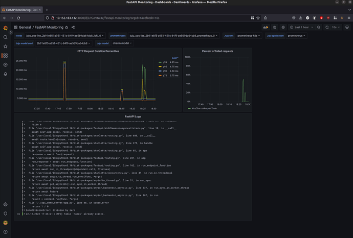

(observe-your-charm-with-cos-lite)=
# Observe your charm with COS Lite

> <small> {ref}`From Zero to Hero: Write your first Kubernetes charm <from-zero-to-hero-write-your-first-kubernetes-charm>` > Observe your charm with COS Lite </small>
>
> **See previous: {ref}`Expose your charm's operational tasks via actions <expose-operational-tasks-via-actions>`**


````{important}

This document is part of a  series, and we recommend you follow it in sequence.  However, you can also jump straight in by checking out the code from the previous chapter:

```text
git clone https://github.com/canonical/operator.git
cd operator/examples/k8s-4-action
```

````

In a production deployment it is essential to observe and monitor the health of your application. A charm user will want to be able to collect real time metrics and application logs, set up alert rules, and visualise any collected data in a neat form on a dashboard.

Our application is prepared for that -- as you might recall, it uses [`starlette-exporter`](https://pypi.org/project/starlette-exporter/) to generate real-time application metrics and to expose them via a `/metrics` endpoint that is designed to be scraped by [Prometheus](https://prometheus.io/). As a charm developer, you'll want to use that to make your charm observable.

In the charming universe, what you would do is deploy the existing [Canonical Observability Stack (COS) lite bundle](https://charmhub.io/cos-lite) -- a convenient collection of charms that includes all of [Prometheus](https://charmhub.io/prometheus-k8s), [Loki](https://charmhub.io/loki-k8s), and [Grafana](https://charmhub.io/grafana-k8s) -- and then integrate your charm with Prometheus to collect real-time application metrics; with Loki to collect application logs; and with Grafana to create dashboards and visualise collected data.

In this part of the tutorial we will follow this process to collect various metrics and logs about your application and visualise them on a dashboard.

## Fetch libraries

Your charm will need several more libraries from Charmhub.

Ensure you're in your Multipass Ubuntu VM, in your charm project directory. Then, in `charmcraft.yaml`, extend the `charm-libs` section:

```yaml
charm-libs:
  - lib: data_platform_libs.data_interfaces
    version: "0"
  - lib: grafana_k8s.grafana_dashboard
    version: "0"
  - lib: loki_k8s.loki_push_api
    version: "1"
  - lib: observability_libs.juju_topology
    version: "0"
  - lib: prometheus_k8s.prometheus_scrape
    version: "0"
```

Next, run the following command to download the libraries:

```text
ubuntu@juju-sandbox-k8s:~/fastapi-demo$ charmcraft fetch-libs
```

You might see a warning that Charmcraft cannot get a keyring. You can ignore the warning.

After Charmcraft has downloaded the libraries, your project's `lib` directory contains:

```text
lib
└── charms
    ├── data_platform_libs
    │   └── v0
    │       └── data_interfaces.py
    ├── grafana_k8s
    │   └── v0
    │       └── grafana_dashboard.py
    ├── loki_k8s
    │   └── v1
    │       └── loki_push_api.py
    ├── observability_libs
    │   └── v0
    │       └── juju_topology.py
    └── prometheus_k8s
        └── v0
            └── prometheus_scrape.py
```

## Add dependencies from libraries

When you use libraries from Charmhub, you must check whether the libraries have any dependencies apart from `ops`.

If you open `lib/charms/grafana_k8s/v0/grafana_dashboard.py` and the other library files, you'll see that some of the libraries depend on the `cosl` package:

- `grafana_dashboard.py` specifies `PYDEPS = ["cosl >= 0.0.50"]`
- `loki_push_api.py` specifies `PYDEPS = ["cosl"]`
- `prometheus_scrape.py` specifies `PYDEPS = ["cosl>=0.0.53"]`

This means that you need to add `cosl>=0.0.53` to your charm's dependencies.

To update your charm's dependencies in `pyproject.toml`, run:

```text
uv add 'cosl>=0.0.53'
```

## Integrate with Prometheus

Follow the steps below to make your charm capable of integrating with the existing [Prometheus](https://charmhub.io/prometheus-k8s) charm. This will enable your charm user to collect real-time metrics about your application.

### Define the Prometheus relation interface

In your `charmcraft.yaml` file, after the `requires` block, add a `provides` endpoint with relation name `metrics-endpoint` and interface name `prometheus_scrape`, as below. This declares that your charm can offer services to other charms over the `prometheus-scrape` interface. In short, that your charm is open to integrating with, for example, the official Prometheus charm. (Note: `metrics-endpoint` is the default relation name recommended by the `prometheus_scrape` interface library.)

```yaml
provides:
  metrics-endpoint:
    interface: prometheus_scrape
    optional: true
```

## Import the Prometheus interface libraries and set up Prometheus scraping

In your `src/charm.py` file, do the following:

First, at the top of the file, import the `prometheus_scrape` library:

```python
from charms.prometheus_k8s.v0.prometheus_scrape import MetricsEndpointProvider
```

Now, in your charm's `__init__` method, initialise the `MetricsEndpointProvider` instance with the desired scrape target, as below. Note that this uses the relation name that you specified earlier in the `charmcraft.yaml` file. Also, reflecting the fact that you've made your charm's port configurable (see previous chapter {ref}`Make the charm configurable <make-your-charm-configurable>`), the target job is set to be consumed from config. The URL path is not included because it is predictable (defaults to /metrics), so the Prometheus library uses it automatically. The last line, which sets the `refresh_event` to the `config_change` event, ensures that the Prometheus charm will change its scraping target every time someone changes the port configuration. Overall, this code will allow your application to be scraped by Prometheus once they've been integrated.

```python
# Provide a metrics endpoint for Prometheus to scrape.
try:
    config = self.load_config(FastAPIConfig)
except ValueError as e:
    logger.warning("Unable to add metrics: invalid configuration: %s", e)
else:
    self._prometheus_scraping = MetricsEndpointProvider(
        self,
        relation_name="metrics-endpoint",
        jobs=[{"static_configs": [{"targets": [f"*:{config.server_port}"]}]}],
        refresh_event=self.on.config_changed,
    )
```

Congratulations, your charm is ready to be integrated with Prometheus!

## Integrate with Loki

Follow the steps below to make your charm capable of integrating with the existing [Loki](https://charmhub.io/loki-k8s) charm. This will enable your charm user to collect application logs.

### Define the Loki relation interface

In your `charmcraft.yaml` file, beneath your existing `requires` endpoint, add another `requires` endpoint with relation name `logging` and interface name `loki_push_api`. This declares that your charm can optionally make use of services from other charms over the `loki_push_api` interface. In short, that your charm is open to integrating with, for example, the official Loki charm. (Note: `logging` is the default relation name recommended by the `loki_push_api` interface library.)

```yaml
requires:
  database:
    interface: postgresql_client
    limit: 1
    optional: false
  logging:
    interface: loki_push_api
    optional: true
```

## Import the Loki interface libraries and set up the Loki API

In your `src/charm.py` file, do the following:

First, import the `loki_push_api` lib:

```python
from charms.loki_k8s.v1.loki_push_api import LogForwarder
```

Then, in your charm's `__init__` method, initialise the `LogForwarder` instance as shown below. The `logging` relation name comes from the `charmcraft.yaml` file. Overall this code ensures that your application can push logs to Loki (or any other charms that implement the `loki_push_api` interface).

```python
# Enable pushing application logs to Loki.
self._logging = LogForwarder(self, relation_name="logging")
```

Congratulations, your charm can now also integrate with Loki!

## Integrate with Grafana

Follow the steps below to make your charm capable of integrating with the existing [Grafana](https://charmhub.io/grafana-k8s) charm. This will allow your charm user to visualise the data collected from Prometheus and Loki.

### Define the Grafana relation interface

In your `charmcraft.yaml` file, add another `provides` endpoint with relation name `grafana-dashboard` and interface name `grafana_dashboard`, as below. This declares that your charm can offer services to other charms over the `grafana-dashboard` interface. In short, that your charm is open to integrations with, for example, the official Grafana charm. (Note: Here `grafana-dashboard` endpoint is the default relation name recommended by the `grafana_dashboard` library.)

```yaml
provides:
  metrics-endpoint:
    interface: prometheus_scrape
    optional: true
  grafana-dashboard:
    interface: grafana_dashboard
    optional: true
```

### Import the Grafana interface libraries and set up the Grafana dashboards

In your `src/charm.py` file, do the following:

First, at the top of the file, import the `grafana_dashboard` lib:

```python
from charms.grafana_k8s.v0.grafana_dashboard import GrafanaDashboardProvider
```

Now, in your charm's `__init__` method, initialise the `GrafanaDashboardProvider` instance, as below. The `grafana-dashboard` is the relation name you defined earlier in your `charmcraft.yaml` file. Overall, this code states that your application supports the Grafana interface.

```python
# Provide grafana dashboards over a relation interface.
self._grafana_dashboards = GrafanaDashboardProvider(
    self, relation_name="grafana-dashboard"
)
```

Now, in your `src` directory, create a subdirectory called `grafana_dashboards` and, in this directory, create a file called `FastAPI-Monitoring.json.tmpl` with the following content:
[FastAPI-Monitoring.json.tmpl](https://raw.githubusercontent.com/canonical/operator/refs/heads/main/examples/k8s-5-observe/src/grafana_dashboards/FastAPI-Monitoring.json.tmpl). Once your charm has been integrated with Grafana, the `GrafanaDashboardProvider` you defined just before will take this file as well as any other files defined in this directory and put them into a Grafana files tree to be read by Grafana.

```{important}

**How to build a Grafana dashboard is beyond the scope of this tutorial. However, if you'd like to get a quick idea:** The dashboard template file was created by manually building a Grafana dashboard using the Grafana web UI, then exporting it to a JSON file and updating the `datasource` `uid` for Prometheus and Loki from constant values to the dynamic variables `"${prometheusds}"` and `"${lokids}"`, respectively.

```

## Validate your charm

Open a shell in your Multipass Ubuntu VM, navigate inside your project directory, and run all of the following.

First, repack and refresh your charm:

```text
charmcraft pack
juju refresh \
  --path="./fastapi-demo_amd64.charm" \
  fastapi-demo --force-units --resource \
  demo-server-image=ghcr.io/canonical/api_demo_server:1.0.2
```

Next, test your charm's ability to integrate with Prometheus, Loki, and Grafana by following the steps below.

### Deploy COS Lite

Create a Juju model called `cos-lite` and, to this model, deploy the Canonical Observability Stack bundle [`cos-lite`](https://charmhub.io/topics/canonical-observability-stack), as below. This will deploy all the COS applications (`alertmanager`, `catalogue`, `grafana`, `loki`, `prometheus`, `traefik`), already suitably integrated with one  another.  Note that these also include the applications that you've been working to make your charm integrate with -- Prometheus, Loki, and Grafana.

```text
juju add-model cos-lite
juju deploy cos-lite --trust
```

```{important}

**Why put COS Lite in a separate model?** Because (1) it is always a good idea to separate logically unrelated applications in different models and (2) this way you can observe applications across all your models. PS In a production-grade scenario you would actually even want to put your COS Lite in a separate *cloud* (i.e., Kubernetes cluster). This is recommended, for example, to ensure proper hardware resource allocation.
```

### Expose the application relation endpoints

Once all the COS Lite applications are deployed and settled down (you can monitor this by using `juju status --watch 2s`),  expose the relation points you are interested in for your charm -- `loki:logging`, `grafana-dashboard`, and `metrics-endpoint` -- as below.

```text
juju offer prometheus:metrics-endpoint
juju offer loki:logging
juju offer grafana:grafana-dashboard
```

Validate that the offers have been successfully created by running:

```text
juju find-offers cos-lite
```

You should see something similar to the output below:

```text
Store          URL                        Access  Interfaces
concierge-k8s  admin/cos-lite.loki        admin   loki_push_api:logging
concierge-k8s  admin/cos-lite.prometheus  admin   prometheus_scrape:metrics-endpoint
concierge-k8s  admin/cos-lite.grafana     admin   grafana_dashboard:grafana-dashboard
```

As you might notice from your knowledge of Juju, this is essentially preparing these endpoints, which exist in the `cos-lite` model, for a cross-model relation with your charm, which you've deployed to the `testing` model.

## Integrate your charm with COS Lite

Now switch back to the charm model and integrate your charm with the exposed endpoints, as below. This effectively integrates your application with Prometheus, Loki, and Grafana.

```text
juju switch testing
juju integrate fastapi-demo admin/cos-lite.grafana
juju integrate fastapi-demo admin/cos-lite.loki
juju integrate fastapi-demo admin/cos-lite.prometheus
```

### Access your applications from the host machine

```{important}
There is currently an issue with this part of the tutorial. If you follow the instructions, you may not be able to access Grafana from your host machine. We're working on improving the instructions. Check back soon for the new instructions!
```

The power of Grafana lies in the way it allows you to visualise metrics on a dashboard. Thus, in the general case you will want to open the Grafana Web UI in a web browser. However, you are now working in a headless VM that does not have any user interface. This means that you will need to open Grafana in a web browser on your host machine. To do this, you will need to add IP routes to the Kubernetes network inside of our VM.

First, run:

```text
juju status -m cos-lite
```

This should result in an output similar to the one below:

```text
Model     Controller     Cloud/Region  Version  SLA          Timestamp
cos-lite  concierge-k8s  k8s           3.6.13   unsupported  18:05:07+01:00

App           Version  Status  Scale  Charm             Channel        Rev  Address         Exposed  Message
alertmanager  0.27.0   active      1  alertmanager-k8s  1/stable       180  10.152.183.70   no
catalogue              active      1  catalogue-k8s     1/stable        87  10.152.183.19   no
grafana       9.5.21   active      1  grafana-k8s       1/stable       160  10.152.183.132  no
loki          2.9.6    active      1  loki-k8s          1/stable       199  10.152.183.207  no
prometheus    2.52.0   active      1  prometheus-k8s    1/stable       247  10.152.183.196  no
traefik       2.11.0   active      1  traefik-k8s       latest/stable  263  10.152.183.83   no       Serving at 10.223.2.63
```

From this output, from the `Address` column, retrieve the IP address for each app to obtain the  Kubernetes service IP address range. Make a note of each as well as the range. (In our output we got the `10.152.183.0-10.152.183.255` range.)

```{caution}

Do not mix up Apps and Units -- Units represent Kubernetes pods while Apps represent Kubernetes Services.  Note: The charm should be programmed to support Services.
```

Now open a terminal on your host machine and run:

```text
multipass info juju-sandbox-k8s
```

This should result in an output similar to the one below:

```text
Name:           juju-sandbox-k8s
State:          Running
Snapshots:      1
IPv4:           10.112.13.157
                10.49.132.1
                10.1.157.64
Release:        Ubuntu 24.04.3 LTS
Image hash:     2b5f90ffe818 (Ubuntu 24.04 LTS)
CPU(s):         4
Load:           0.31 0.25 0.28
Disk usage:     19.4GiB out of 48.4GiB
Memory usage:   3.2GiB out of 7.7GiB
Mounts:         /home/me/k8s-tutorial => ~/fastapi-demo
                    UID map: 1000:default
                    GID map: 1000:default
```

From this output, retrieve your Multipass Ubuntu VM's network IP address. In our case it is `10.112.13.157`.

Now, also on your host machine, run the code below.  Until the next reboot, this will forward all the traffic for your Kubernetes Service IP range via the network on your VM. This will allow you, for example, to view your Grafana dashboards in a web browser inside your VM, as we do in the next step.

```text
sudo ip route add 10.152.183.0/24 via 10.112.13.157
```

## Log in to Grafana

In a terminal inside your VM, do all of the following:

First, run `juju status` again to retrieve the IP address of your Grafana service.  For us it is `http://10.152.183.132:3000` (see the output above).

Now, use `juju run` to retrieve your Grafana password, as shown below.

```text
juju run grafana/0 -m cos-lite get-admin-password --wait 1m
```

Now, on your host machine, open a web browser, enter the Grafana IP address, and use the username "admin" and your Grafana password to log in.

### Inspect the dashboards

In your Grafana web page, do all of the following:

Click `FastAPI Monitoring`. You should see the Grafana Dashboard that we uploaded to the `grafana_dashboards` directory of your charm.

Next, in the `Juju model` drop down field, select `testing`.

Now, call a couple of API points on the application, as below. To produce some successful requests and some requests with code 500 (internal server error), call several times, in any order.

```text
curl 10.1.157.94:8000/names
```

and

```text
curl 10.1.157.94:8000/error
```

where `10.1.157.94` is the IP of our application unit (pod).

In a while you should see the following data appearing on the dashboard:

1. HTTP Request Duration Percentiles. This dashboard is based on the data from Prometheus and will allow you to see what fraction of requests takes what amount of time.
2. Percent of failed requests per 2 minutes time frame. In your case this will be a ratio of all the requests and the requests submitted to the `/error` path (i.e., the ones that cause the Internal Server Error).
3. Logs from your application that were collected by Loki and forwarded to Grafana. Here you can see some INFO level logs and ERROR logs with traceback from Python when you were calling the `/error` path.



```{important}

If you are interested in the Prometheus metrics produced by your application that were used to build these dashboards you can run following command in your VM: `curl <your app pod IP>:8000/metrics`
Also, you can reach Prometheus in your web browser (similar to Grafana) at `http://<Prometheus pod IP>:9090/graph` .
```

## Review the final code

For the full code, see [our example charm for this chapter](https://github.com/canonical/operator/tree/main/examples/k8s-5-observe).

## Next steps

Congratulations on reaching the end of the tutorial!

For suggestions of what to explore next, see [](#tutorial-kubernetes-next-steps).
