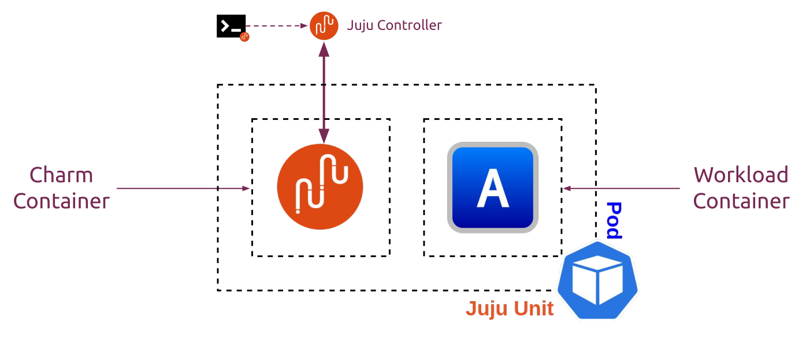
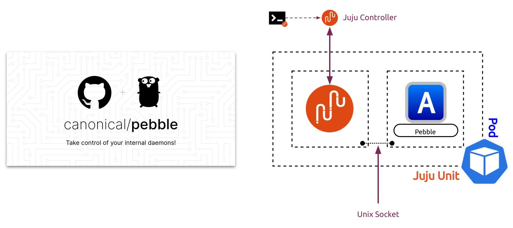
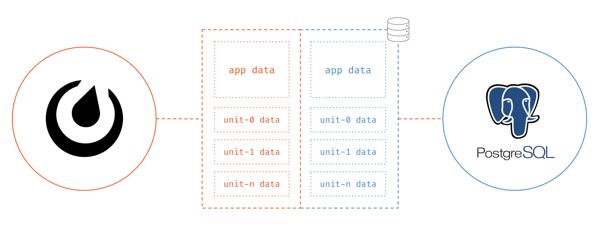
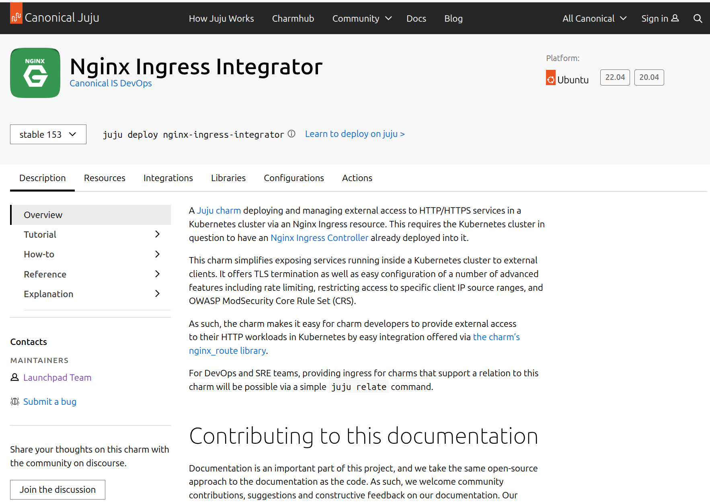

# Charmed Operator Development Workshop
[@jnsgruk](https://jnsgr.uk/)

---

## Development Setup

```bash
# Install Concierge
sudo snap install --classic concierge
sudo concierge prepare -p dev
```

---

## Join the Charming Community

- Charmhub: [https://charmhub.io](https://charmhub.io)
- Forum: [https://discourse.charmhub.io](https://discourse.charmhub.io)
- Chat: [https://matrix.to/#/#charmhub-charmdev:ubuntu.com](https://matrix.to/#/#charmhub-charmdev:ubuntu.com)

---

## Juju Basics

### Controllers

The management node(s) of a deployed Juju cloud environment.

- Cloud-specific
- Multi-cloud
- Hosted (JAAS)

### Models and Applications


### Applications and Units


---

## Charmed Operator Basics

- Application domain knowledge, distilled into code
- Application code is open source. *Why not share the operations code too?*

### Charms are ops code, packaged

Lifecycle:

- `install`
- `config`
- `update`
- `remove`
- `scale`

Actions:

- `action_backup`
- `action_restore`
- `action_scan-viruses`
- `action_add-repo`
- `action_verify_sigs`
- etc.

Integration:

- `relate_mysql`
- `relate_ldap`
- `relate_proxy`

---

## Charmed Operators on Kubernetes

- `juju add-model new-model`: Creates a Kubernetes namespace 'new-model'
- `juju deploy <application>`: Create a `StatefulSet` named 'application' with 1 replica
- `juju scale-application <application> 2`: Set # of replicas to 2 for the `StatefulSet`



---

# Pebble



## Pebble Layers

Day 1:

```yaml
services:
  super-service:
    override: replace
    summary: The super service
    command: /super -a -p 80
    startup: enabled
```

Day 2:

```yaml
services:
  super-service:
    override: merge
    environment:
      VAR1: value-1
      VAR2: value-2
```

Results:

```yaml
services:
  super-service:
    override: replace
    summary: The super service
    command: /super -a -p 80
    startup: enabled
    environment:
      VAR1: value-1
      VAR2: value-2
```

---

Simple operations code, written in Python

Consistent operator UX and CLI for all operators

Comprehensive unit testing harness

Simplified code-sharing and integration

---

## Workshop Outcome

* [x] Start a workload
* [x] Handle configuration
* [x] Day-2 action specification
* [x] Utilise a charm library
* [x] Integrate with another application
* [x] Unit test the operator

---


---

## Key Information

- [A Charmed Operator demonstration for Operator Day 2021, hosted by Canonical](https://github.com/canonical/operator/tree/main/examples/gosherve)
- [A simple HTTP file server with some basic URL shortening/redirect functionality](https://github.com/jnsgruk/gosherve)

---

## Development Setup

```bash
# Install Concierge
sudo snap install --classic concierge
sudo concierge prepare -p dev
```

---

## Charm Initialisation

```bash
# Create the Charm directory
mkdir hello-kubecon && cd hello-kubecon
# Initialise the Charm directory
charmcraft init --profile=kubernetes
```

```
├── charmcraft.yaml        # Package description and metadata
├── CONTRIBUTING.md        # Skeleton contribution guide
├── LICENSE                # Your Charm's license, we recommend Apache 2
├── pyproject.toml         # Standard Python tooling configuration
├── README.md              # The front page documentation for your charm
├── requirements.txt       # PyPI requirements for the charm runtime environment
├── src                    # Top-level source code directory for Charm
│   └── charm.py           # Minimal operator using Ops
├── tests                  # Top-level directory for Charm tests
│   ├── integration
│   │   └── test_charm.py  # Skeleton integration tests for generated charm
│   └── unit
│       └── test_charm.py  # Skeleton unit tests for generated charm
└── tox.ini                # Tooling to format, lint, and run tests
```

---

## Starting our Workload

`charmcraft.yaml`

```yaml
# See LICENSE file for licensing details.
name: hello-kubecon
description: |
 A basic demonstration charm that hosts a placeholder webpage with links
 to various Juju/Ops pages. Hosted using a small, custom
 webserver written in Go (https:./github.com/jnsgruk/gosherve). Illustrates
 the use of charm workloads, actions, config, storage and relations.
summary: |
 A demonstration charm for Kubecon Operator Day 2021.
containers:
 gosherve:
  resource: gosherve-image
resources:
 gosherve-image:
  type: oci-image
  description: OCI image for gosherve
```

---

## Starting our Workload

`src/charm.py`

```python
def _on_gosherve_pebble_ready(self, event: ops.PebbleReadyEvent):
    container = event.workload
    pebble_layer = {
        "summary": "gosherve layer",
        "description": "pebble config layer for gosherve",
        "services": {
            "gosherve": {
                "override": "replace",
                "summary": "gosherve",
                "command": "/gosherve",
                "startup": "enabled",
                "environment": {
                    "REDIRECT_MAP_URL": "https://github.com/canonical/operator/tree/main/examples/gosherve-demo/demo-routes"
                },
            }
        },
    }
    container.add_layer("gosherve", pebble_layer, combine=True)
    container.autostart()
    self.unit.status = ActiveStatus()
```

---

## Test Deployment

### Build & Deploy

```bash
# Build the charm
$ charmcraft pack
# Deploy the charm
$ juju deploy ./gosherve-demo-k8s_amd64.charm --resource gosherve-image=jnsgruk/gosherve
# Check the Juju status
$ juju status --watch=1s
```

### Verify

```bash
$ curl http://10.1.215.221:8080/ops
<a href="https://github.com/canonical/operator">Found.</a>.
```

---

## Explore & Troubleshoot Deployment

### Juju Debug Log

```bash
# Set the log level to DEBUG for the development model
$ juju model-config logging-config="<root>=WARNING;unit=DEBUG"
# Follow the debug-log
$ juju debug-log
```

### Explore with kubectl

```bash
$ kubectl -n development get pods
```

---

# Handling Configuration

`juju config application theme=breeze`

---

## Handling Configuration

`charmcraft.yaml`

```yaml
config:
  options:
    redirect-map:
      default: https://github.com/canonical/operator/tree/main/examples/gosherve-demo/demo-routes
      description: A URL pointing to a list of redirects for Gosherve.
      type: string
```

---

## Handling Configuration

`src/charm.py`

```python
@dataclasses.dataclass(frozen=True, kw_only=True)
class GosherveConfig:
    """Configuration for the Gosherve charm."""

    redirect_map: str = 'https://github.com/canonical/operator/tree/main/examples/gosherve-demo/demo-routes'
    """A URL pointing to a list of redirects for Gosherve."""

    def __post_init__(self):
        """Validate the configuration."""
        if not self.redirect_map:
            raise ValueError('redirect-map must be set in the configuration.')
        if not self.redirect_map.startswith('http'):
            raise ValueError(
                f'Invalid redirect-map URL: {self.redirect_map}. '
                "It must start with 'http' or 'https'."
            )
```

---

## Handling Configuration

`src/charm.py`

```python
def _gosherve_layer(self):
    """Returns a Pebble configuration layer for Gosherve"""
    config = self.load_config(GosherveConfig, errors='blocked')
    return {
        "summary": "gosherve layer",
        "description": "pebble config layer for gosherve",
        "services": {
            "gosherve":
            {
                "override": "replace",
                "summary": "gosherve",
                "command": "/gosherve",
                "startup": "enabled",
                "environment": {
                    "REDIRECT_MAP_URL": config.redirect_map,
                },
            },
        },
    }
```

## Handling Configuration

`src/charm.py`

```python
def _on_config_changed(self, _: ops.ConfigChangedEvent | ops.PebbleReadyEvent):
    """Handle the config-changed and pebble-ready events."""
    # Get the gosherve container so we can configure/manipulate it:
    container = self.unit.get_container('gosherve')
    # Create a new config layer:
    layer = self._gosherve_layer()

    try:
        container.add_layer('gosherve', layer, combine=True)
        logging.info("Added updated layer 'gosherve' to Pebble plan.")
        # Tell Pebble to load the new layer and restart the service if needed:
        container.replan()
        logging.info('Replanned gosherve service.')
    except ops.pebble.ConnectionError:
        self.unit.status = ops.WaitingStatus('waiting for Pebble in workload container')
        # We assume here that we'll get a pebble-ready event later, and we
        # will add the layer then.
    else:
        # All is well, set an ActiveStatus
        self.unit.status = ops.ActiveStatus()
```

---

## Test Deployment

### Build & Deploy

```bash
# Build the charm
$ charmcraft pack
# Deploy the charm
$ juju refresh gosherve-demo-k8s --path=./gosherve-demo_amd64.charm
# Check the Juju status - note the blocked status
$ juju status --watch=1s
```

### Set Configuration

```bash
# Change the configuration
$ juju config hello-kubecon redirect-map="https://jnsgr.uk/demo-routes-alt"
# Check the juju status - note the active status
$ juju status --watch=1s
```

---

## Handling Storage

`charmcraft.yaml`

```yaml
containers:
  gosherve:
    resource: gosherve-image
    mounts:
      - storage: webroot
        location: /srv

storage:
  webroot:
    type: filesystem
    location: /srv
```

## Handling Storage

`src/charm.py`

```python
def _gosherve_layer(self) -> ops.pebble.LayerDict:
    """Returns a Pebble configuration layer for Gosherve."""
    config = self.load_config(GosherveConfig, errors='blocked')
    return {
        'summary': 'gosherve layer',
        'description': 'pebble config layer for gosherve',
        'services': {
            'gosherve': {
                'override': 'replace',
                'summary': 'gosherve',
                'command': '/gosherve',
                'startup': 'enabled',
                'environment': {
                    'REDIRECT_MAP_URL': config.redirect_map,
                    'WEBROOT': '/srv',
                },
            }
        },
    }
```

## Handling Storage

`src/charm.py`

```python
class HelloKubeconCharm(ops.CharmBase):
    """Charm the service."""

    def __init__(self, framework: ops.Framework):
        super().__init__(framework)
        framework.observe(self.on.install, self._on_install)
        framework.observe(self.on.config_changed, self._on_config_changed)

    def _on_install(self, _: ops.InstallEvent):
        # Download the site:
        self._fetch_site()
```

---

## Fetching the demo site

`src/charm.py`

```python
def _fetch_site(self):
    """Fetch latest copy of website from GitHub and move into webroot."""
    # Set the site URL:
    site_src = 'https://jnsgr.uk/demo-site'
    # Set some status and do some logging:
    self.unit.status = ops.MaintenanceStatus('Fetching web site')
    logger.info('Downloading site from %s', site_src)
    # Download the site:
    urllib.request.urlretrieve(site_src, '/srv/index.html')  # noqa: S310
    # Set the unit status back to Active:
    self.unit.status = ops.ActiveStatus()
```

---

## Test Deployment

### Build & Deploy

```bash
# Build the charm
$ charmcraft pack
# Remove old charm
$ juju remove-application gosherve-demo-k8s
# Redeploy
$ juju deploy ./gosherve-demo-k8s_amd64.charm --resource gosherve-image=jnsgruk/gosherve
# Check the juju status
$ juju status --watch=1s
```

### Verify

```bash
# Verify
$ curl "http:./<ip-address.:8080/"
```

### Explore

```bash
# Explore
$ kubectl -n development describe pod gosherve-demo-k8s-0
```

---

## Implementing an action

`charmcraft.yaml`

```yaml
actions:
  pull-site:
    description: Unpack latest version of website from remote source.
```

---

## Implementing an action

`src/charm.py`

```python
...

def __init__(self, framework: ops.Framework):
    super().__init__(framework)
    framework.observe(self.on.install, self._on_install)
    framework.observe(self.on.config_changed, self._on_config_changed)
    framework.observe(self.on['pull_site'].action, self._pull_site_action)

...

def _pull_site_action(self, event: ops.ActionEvent):
    """Action handler that pulls the latest site archive and unpacks it."""
    self._fetch_site()
    event.set_results({'result': 'site pulled'})

...
```

---

## Test Deployment

### Build & Deploy

```bash
# Build the charm
$ charmcraft pack
# Refresh
$ juju refresh gosherve-demo-k8s --path=./gosherve-demo-k8s_amd64.charm
# Check the juju status
$ juju status --watch=1s
```

### Run the 'pull-site' action

```bash
# Run the action
$ juju run gosherve-demo-k8s/0 pull-site --format=yaml
Running operation 1 with 1 task
  - task 2 on gosherve-demo-k8s/0

Waiting for task 2...
gosherve-demo-k8s/0:
  id: "2"
  results:
# ...
```

---

# Relations, Libraries, Ingress


---

## Relations


---

## Relations


---

## Relations



---

## Relations


---

## Relations


---

## Relations


---

## Relations


---

## Relations


---

## Relations


---

## Relations


---

## Ingress Charm



---

## Libraries


---

## Relations, Libraries and Ingress

Fetch and integrate the library:

`charmcraft.yaml`

```yaml
charm-libs:
  - lib: traefik_k8s.ingress
    version: "1"
```

```bash
# Fetch the library into our charm
$ charmcraft fetch-libs
# Ensure library was imported into the correct place
$ ls -l lib/charms/traefik_k8s/v1/
```

---

## Relations, Libraries and Ingress

`charmcraft.yaml`

```yaml
name: hello-kubecon
summary: |
  A demonstration charm for Kubecon Operator Day 2021.
description: |
  A basic demonstration charm that hosts a placeholder webpage with links
  to various Juju/Ops pages. Hosted using a small, custom
  webserver written in Go (https://github.com/jnsgruk/gosherve). Illustrates
  the use of charm workloads, actions, config, storage and relations.

# ...

requires:
  ingress:
    interface: ingress
    limit: 1
    optional: false
```

---

## Relations, Libraries and Ingress

`src/charm.py`

```python
from charms.traefik_k8s.v1.ingress import IngressPerAppRequirer
...

class HelloKubeconCharm(ops.CharmBase):
    """Charm the service."""

    def __init__(self, framework: ops.Framework):
        super().__init__(framework)
        framework.observe(self.on.install, self._on_install)
        framework.observe(self.on.config_changed, self._on_config_changed)
        framework.observe(self.on['gosherve'].pebble_ready, self._on_config_changed)
        framework.observe(self.on['pull_site'].action, self._pull_site_action)
        self.ingress = IngressPerAppRequirer(
            self,
            port=8080,
            host=f'{self.app.name}-endpoints.{self.model.name}.svc.cluster.local',
            strip_prefix=True,
        )
```

---

## Test Deployment

### Build & Deploy

```bash
# Build the charm
$ charmcraft pack
# Refresh the deployment
$ juju refresh gosherve-demo-k8s --path=./gosherve-demo-k8s_amd64.charm
```

### Deploy and Integrate Ingress

```bash
# Deploy the traefik-k8s
$ juju deploy traefik-k8s --trust
# Relate our application to the ingress integrator
$ juju integrate gosherve-demo-k8s traefik-k8s
# Add an entry to our hosts file
$ echo "127.0.1.1 hellokubecon.juju" | sudo tee -a /etc/hosts
# Check the juju status
$ juju status --watch 1s
```

---

## Unit Testing

`tests/unit/test_charm.py`

```python
@pytest.mark.parametrize('config', [None, {'redirect-map': 'https://example.com/routes'}])
def test_gosherve_layer(config: dict[str, str | int | float | bool] | None):
    """Test that the layer has the right environment."""
    ctx = testing.Context(HelloKubeconCharm)
    state_in = testing.State.from_context(ctx, config=config)
    state_out = ctx.run(ctx.on.config_changed(), state_in)
    expected = {
        'summary': 'gosherve layer',
        'description': 'pebble config layer for gosherve',
        'services': {
            'gosherve': {
                'override': 'replace',
                'summary': 'gosherve',
                'command': '/gosherve',
                'startup': 'enabled',
                'environment': {
                    'REDIRECT_MAP_URL': config['redirect-map']
                    if config
                    else 'https://github.com/canonical/operator/tree/main/examples/gosherve-demo/demo-routes',
                    'WEBROOT': '/srv',
                },
            }
        },
    }
    layer = state_out.get_container('gosherve').layers['gosherve']
    assert layer.to_dict() == expected
```

---

## Unit Testing

```python
@pytest.mark.parametrize('event_name', ['config_changed', 'pebble_ready'])
def test_on_config_changed(event_name: str):
    """Test the config-changed and pebble-ready hooks."""
    ctx = testing.Context(HelloKubeconCharm)

    # Trigger a config-changed hook. Since there was no plan initially, the
    # "gosherve" service in the container won't be running.
    container = testing.Container(
        'gosherve',
        service_statuses={'gosherve': ops.pebble.ServiceStatus.INACTIVE},
        can_connect=True,
    )
    state_in = testing.State(containers={container})
    event = (
        ctx.on.pebble_ready(container) if event_name == 'pebble_ready' else ctx.on.config_changed()
    )
    state_out = ctx.run(event, state_in)
    assert state_out.unit_status == testing.ActiveStatus()
    assert (
        state_out.get_container('gosherve').service_statuses['gosherve']
        == ops.pebble.ServiceStatus.ACTIVE
    )
```

---

## Test Deployment

### Run the tests

```bash
$ tox -e unit
[...]
hello-kubecon-example/examples/gosherve-demo/tests/unit
================================================================================== test session starts ===================================================================================
[...]
collected 11 items

tests/unit/test_charm.py::test_gosherve_layer[None] PASSED
tests/unit/test_charm.py::test_gosherve_layer[config1] PASSED
tests/unit/test_charm.py::test_on_config_changed[config_changed] PASSED
tests/unit/test_charm.py::test_on_config_changed[pebble_ready] PASSED
tests/unit/test_charm.py::test_on_config_changed_container_not_ready PASSED
tests/unit/test_charm.py::test_config_values[http://-True] PASSED
tests/unit/test_charm.py::test_config_values[https://-True] PASSED
tests/unit/test_charm.py::test_config_values[file:///-False] PASSED
tests/unit/test_charm.py::test_no_config PASSED
tests/unit/test_charm.py::test_on_install PASSED
tests/unit/test_charm.py::test_pull_site_action PASSED

=================================================================================== 11 passed in 1.12s ===================================================================================
unit: commands[1]> coverage report
Name                       Stmts   Miss Branch BrPart  Cover   Missing
----------------------------------------------------------------------
src/charm.py                  48      5      4      0    90%   109-116
tests/__init__.py              0      0      0      0   100%
tests/unit/test_charm.py      61      0      2      0   100%
----------------------------------------------------------------------
TOTAL                        109      5      6      0    96%
  unit: OK (2.04=setup[0.04]+cmd[1.82,0.18] seconds)
  congratulations :) (2.13 seconds)
```

---

## Workshop outcome - recap!

- [x] Start a workload
- [x] Handle configuration
- [x] Day-2 action specification
- [x] Use a charm library
- [x] Integrate with another app
- [x] Unit test the operator

---

- Simple operations code, written in Python
- Consistent operator UX and CLI for all operators
- Comprehensive unit testing harness
- Simplified code-sharing and integration

---

## Join the Charming Community

- Charmhub: [https://charmhub.io](https://charmhub.io)
- Forum: [https://discourse.charmhub.io](https://discourse.charmhub.io)
- Chat: [https://matrix.to/#/#charmhub-charmdev:ubuntu.com](https://matrix.to/#/#charmhub-charmdev:ubuntu.com)

---

Thank you
